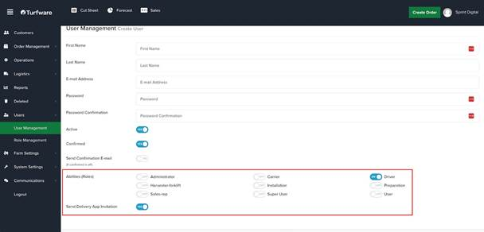

# Sending Invite to Delivery App

In the Backend Portal, when creating a new user, if the user’s role is a driver, tick the “Send Delivery App Invitation” checkbox. An email invitation with a link to download the app will be sent to the user. (See figure below)

