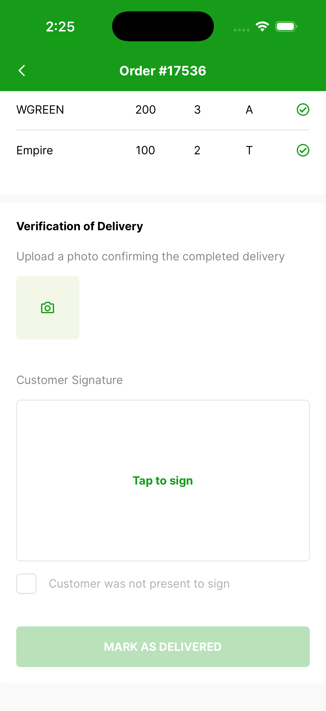
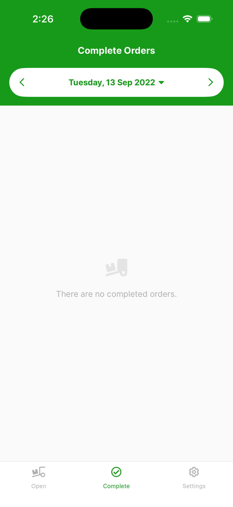

# Completing delivery

At the bottom of an order, the **Verification of Delivery** section is where the driver confirms the drop.

{ width="300" }

To complete the delivery:

- Take or upload a photo as verification of delivery.
- Ask the customer to sign by tapping the **Tap to sign** box under **Customer Signature**.
- If the customer was not present, tick **Customer was not present to sign**.
- Then tap **Mark as Delivered**.

The completed order moves to the completed orders section. To see it, tap **Complete** in the bottom navigation bar.

{ width="300" }
