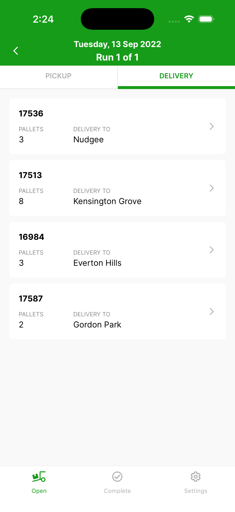
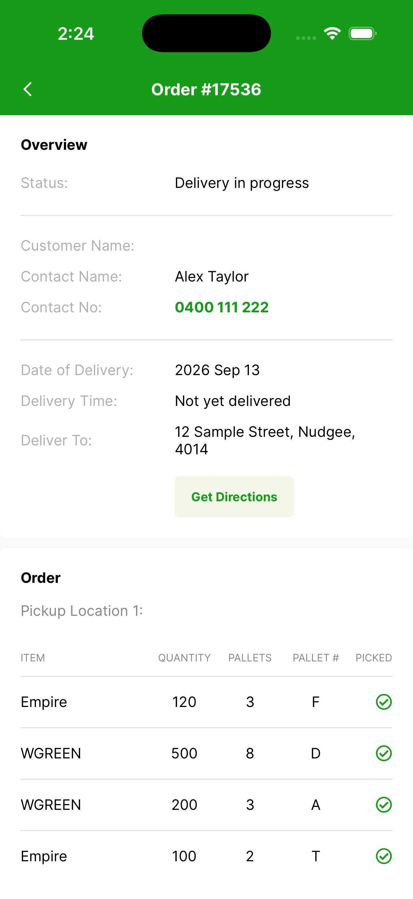

# Order details

Once a run is open, the **Delivery** tab lists every drop — the order number, the number of pallets, and the delivery suburb.

{ width="300" }

Tap any order to view its full details:

{ width="300" }

- **Status** — where the order is up to (for example, *Delivery in progress*).
- **Contact Name / Contact No** — the on-site contact; the number is tap-to-dial (see [Site Contact](site-contact.md)).
- **Date of Delivery**, **Delivery Time**, and the **Deliver To** address, with a **Get Directions** button (see [Using Google Maps](using-google-maps.md)).
- The **Order** section lists each item — turf variety, quantity, pallets, pallet code, and whether it has been picked up.
