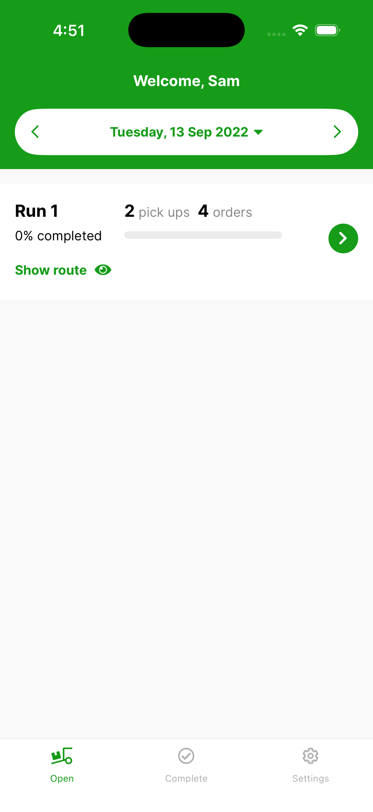

# Driver App Overview

The Driver App is the field app your drivers use to see and complete their assigned deliveries — working through each drop and capturing proof of delivery.

When a driver logs in, they land on the front screen for the day:

{ width="300" }

- **Welcome, [name]** and the delivery date sit at the top. Use the arrows either side of the date, or tap the date, to move to another day.
- **Each run** shows its number of pick ups, its number of orders, and how much of the run is completed.
- **Show route** plots the run's stops on a map — see [Viewing Route from the front screen](viewing-route-from-the-front-screen/viewing-route-from-the-front-screen.md).
- Tap the green arrow on a run to open it and work through its **Pickup** and **Delivery** stops.
- The bottom tabs switch between **Open** (runs still to do), **Complete** (finished orders) and **Settings**.
