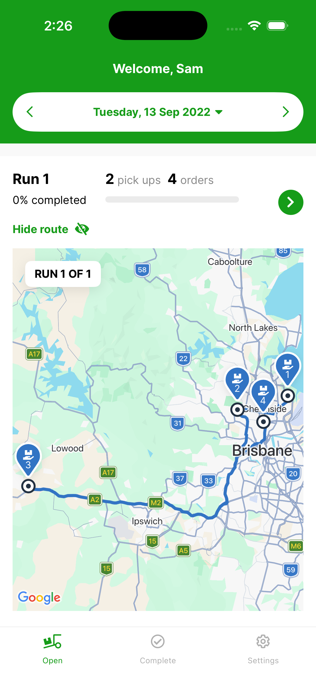

# Viewing Route from the front screen

On the front screen, tap **Show route** on a run to plot its stops on a map.

{ width="300" }

Each stop is numbered in the order it should be delivered. Tap **Hide route** to collapse the map again.
