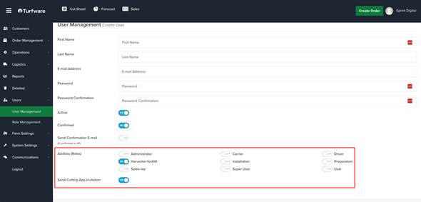

# Sending Invite to Harvesting App

In the Backend Portal, when creating a new user, if the user’s role is a harvester or forklift operator, tick the “Send Harvesting App Invitation” checkbox. An email invitation with a link to download the app will be sent to the user. (See Figure below)

