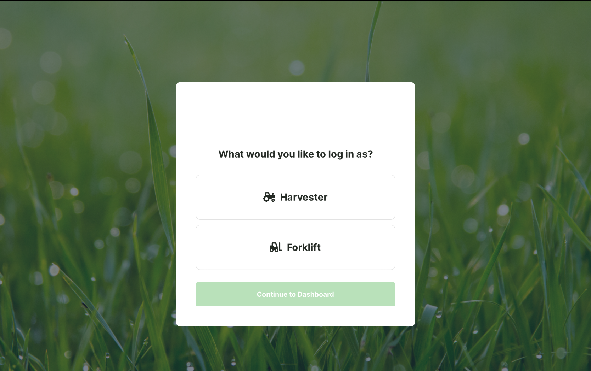
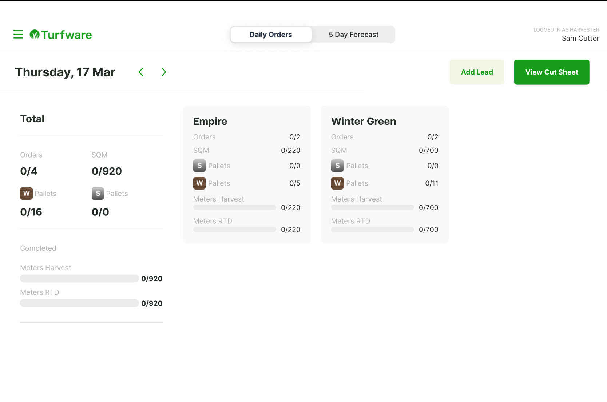

# Harvesting App Overview

The Harvesting App is the iPad app your harvest and forklift team use to work through the day's cutting — seeing what needs to be cut, by variety, and marking it off as it's harvested and dispatched.

## Logging in

After signing in, choose the role you're working as:

- **Harvester** — cutting the turf.
- **Forklift** — moving and dispatching the cut pallets.

Pick one and tap **Continue to Dashboard**.

## The dashboard

The **Daily Orders** dashboard shows the day's cutting at a glance, broken down by turf variety:

- **Total** — orders, m² (SQM) and pallets (W = wood, S = steel) for the whole day, plus completed Meters Harvest and Meters RTD (ready to dispatch).
- **Per-variety cards** (for example Empire and Winter Green) — orders, m², pallets, and harvest/dispatch progress for each grass. Tap a card to focus on just that variety.
- Use the date arrows to change day, **View Cut Sheet** to clear the variety filter and see the whole list, and the **5 Day Forecast** tab to look ahead.
- The top right shows who's logged in and their role.
