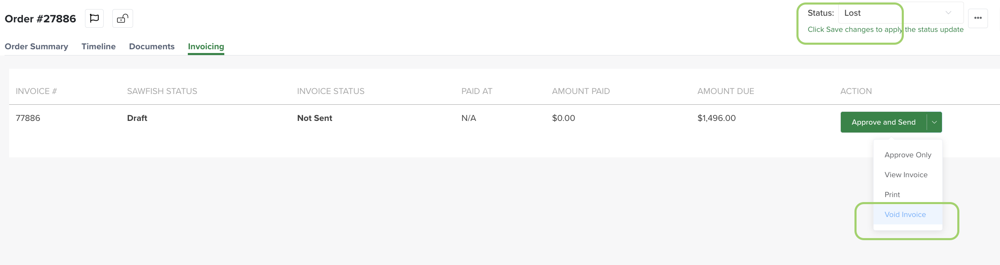

# Cancelling an order & voiding an invoice

When a job isn't going ahead, there are two separate things to deal with — the **invoice** (so the customer isn't chased for money they don't owe) and the **order** itself. Both are done from Turfware.

## Void the invoice

Voiding an invoice from Turfware also cancels it in your accounting system (Sawfish) — Turfware does that for you.

1. Open the order and go to the **Invoicing** tab.
2. On the invoice, open its actions menu (the arrow next to Send) and choose **Void Invoice**.
3. Confirm when prompted — "Are you sure you want to void the invoice?".

The invoice is voided in Sawfish, marked **VOIDED**, and removed from the customer's balance. Nothing more is needed on the accounting side.

The same screen is where you close the order — set the status to **Lost** (top right) and Save changes, as below.

## Close the order

Voiding the invoice does not close the order. To take it out of your workflow, set the order's status to **Lost** — see [Lost](../web-app/order-management/lost.md). It's kept as a record of the job that didn't convert.

!!! warning "Deleting is not the same as voiding"
    Deleting an order does **not** void its invoice — the invoice stays live in Sawfish and the customer can still be chased for it. If an order has been invoiced, Void the invoice first (above), then move the order to Lost. See the [Delete section](../web-app/delete/overview.md).
