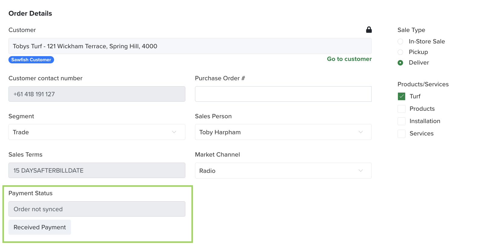
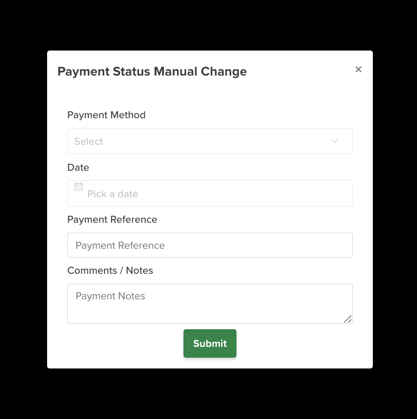

# Recording payments

A payment reaches an order one of two ways: through Sawfish (on the digital invoice) or off-rails (recorded manually).

## Payments through Sawfish

Customers can pay their digital invoice through Sawfish by:

- Credit / debit card
- PayTo
- PayID
- Tap to Pay
- Apple Pay
- Google Pay

Each method is enabled per account (through our merchant partners), so which ones your customers see depends on your Sawfish account setup. A payment taken this way flows automatically: Sawfish marks the invoice paid, Turfware shows the order paid within ~1 minute, and Sawfish posts the payment to your accounting system on the next sync.

For how these options appear to your customer on the digital invoice, see [How customers can pay](https://help.sawfish.com.au/getting-paid/) in the Sawfish help centre.

## Manual (off-rails) payments

Use Received Payment (manual) when a customer pays outside Sawfish — for example cash or an EFTPOS / merchant terminal. It marks the Turfware order as paid so the order can keep moving through the workflow. You'll find it under Payment Status on the order.

When you record a manual payment, complete the popup with the payment details — method, date, reference and any notes — then click Submit.

Turfware then:

- marks the Sawfish invoice as paid — which stops Sawfish's automatic payment-reminder emails to the customer,
- emails the record to your accounts email (set in [Company Information](../web-app/turfware-setup/farm-setup/company-information.md)), and
- saves it to the order's Documents tab.

!!! warning "The money still has to be reconciled"
    A manual payment does not post the money to your accounting system — it's an operational record that tells Turfware (and Sawfish) the order is paid so work can continue and reminders stop. The actual money must still be reconciled in your accounting system by your bookkeeper (cash till balanced, merchant / terminal statement, etc.). This is deliberate: it gives you two layers of control on payments taken outside the normal Sawfish rails.
