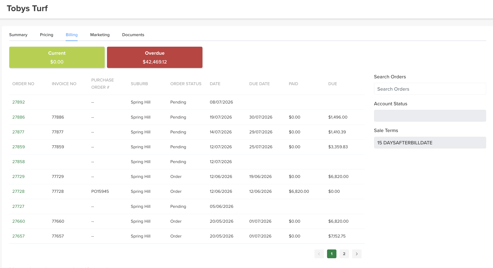

# Billing

The **Billing** tab shows all of a customer's orders and their account position in one place.

## Where to find it

Open the customer → **Billing** tab.

## What it shows

- **Due and Overdue balances** — two boxes at the top give the customer's current **Due** and **Overdue** amounts at a glance.
- **Orders table** — every order for the customer, line by line: order number, PO / reference, invoice number, suburb, status, date, due date, paid and due.
- **Search** — find an order by **order number** or **PO / reference**.
- **Click through** — click any line item to open that order.

!!! tip "Chasing payment"
    The **Overdue** box plus the per-order **due date** column make this the quickest place to see what a customer owes and follow it up.
