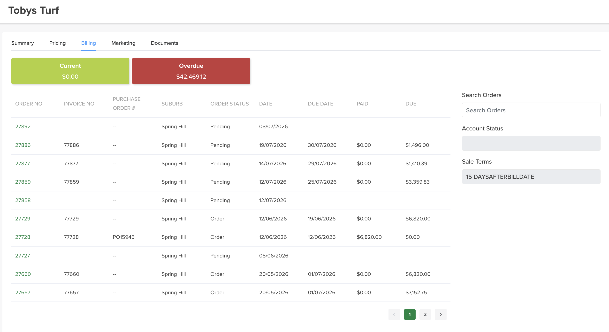

# Billing

The Billing tab shows all of a customer's orders and their account position in one place.

## Where to find it

Open the customer → Billing tab.

## What it shows

- **Current and Overdue balances** — two boxes at the top show the customer's Current and Overdue amounts at a glance. Both are calculated from the customer's **invoices**, the same way Sawfish calculates them, so they match what the customer sees: Current is invoiced amounts not yet due, Overdue is invoiced amounts past their due date. Orders that haven't been invoiced yet aren't counted — un-billed work isn't money owed.
- **Orders table** — every order for the customer, line by line: order number, invoice number, PO / reference, suburb, status, date, due date, paid and due.
- **Account Status and Sale Terms** — down the right, alongside the search, the customer's account status and payment terms (for example *15 days after bill date*).
- **Search** — find an order by order number or PO / reference.
- **Click through** — click any line item to open that order.

!!! note "The balances follow the invoice, not the order"
    The figures track the invoice's real state in Sawfish. If an invoice is reopened there — a reversed payment or a credit — the customer's balance here updates to match, rather than the order staying marked as paid.

!!! tip "Chasing payment"
    The Overdue box plus the per-order due date column make this the quickest place to see what a customer owes and follow it up.
