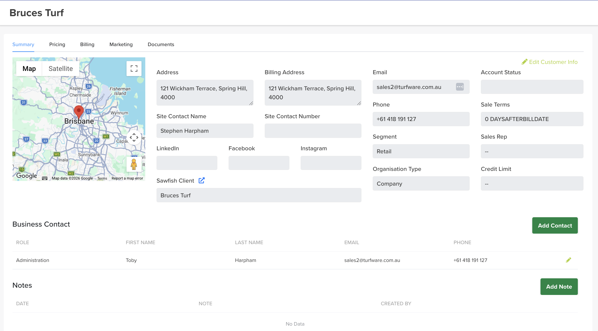
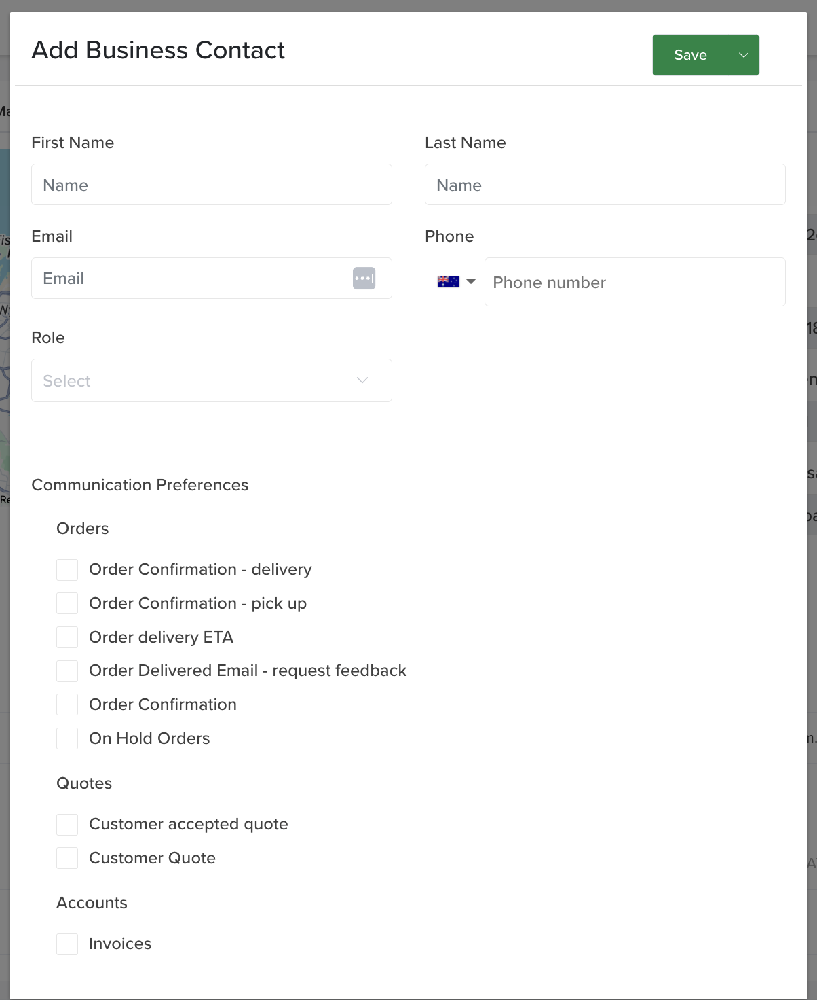
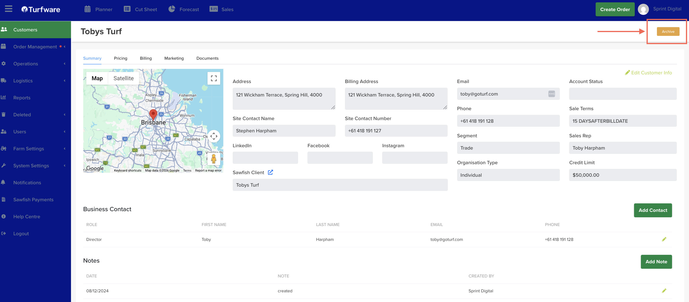

# Customer summary

Open a customer by clicking their row on the Customers page. The Summary tab is the customer's home — their details, contacts and notes in one place. Across the top are five tabs: Summary, Pricing, Billing, Marketing, Documents.

## Customer details

The summary shows the customer's address (mapped), billing address, site contact, email, phone, Segment, Organisation Type, Account Status, Sale Terms, Sales Rep and Credit Limit.

To change any of them, click ✏ Edit Customer Info (top right), update the fields, and save.

## Add a contact

Under Business Contact, click the green Add Contact button. Enter the contact's First / Last name, Email, Phone and Role, then choose their Communication Preferences — exactly which emails this contact receives:

- **Orders** — Order Confirmation (delivery / pick up / general), Order delivery ETA, Order Delivered (request feedback), On Hold Orders.
- **Quotes** — Customer Quote, Customer accepted quote.
- **Accounts** — Invoices.

Tick only what that person should get — e.g. an accounts contact gets Invoices, a site contact gets Order delivery ETA. Click Save.

## Add a note

Under Notes, click the green Add Note button. Notes are for customer call notes and important customer information you want on record — each note stores the date and who created it.

## Open the customer in Sawfish

The Sawfish Client field links straight through (the ↗ icon) to the customer in the Sawfish payments system, where you'll find deeper payment and account information.

## Archiving a customer

Administrators can Archive a customer you no longer deal with — the Archive button, top right of the record. It's hidden from the Customers list but kept, not deleted.

Archived customers drop off the Customers list — flip Show Archived there to see them (their Status shows Archived) and Unarchive to restore one. See [Active and archived customers](index.md#active-and-archived-customers).
