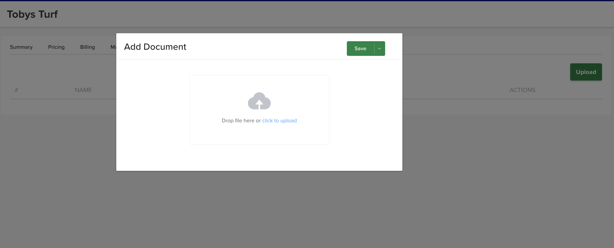

# Documents

The **Documents** tab stores key files against the customer — agreements, credit applications, site plans, anything you want kept on the customer's file.

## Where to find it

Open the customer → **Documents** tab.

## Add a document

Click the green **Upload** button (top right), choose the file, and save. It's now stored against the customer and available to anyone who opens their record.

