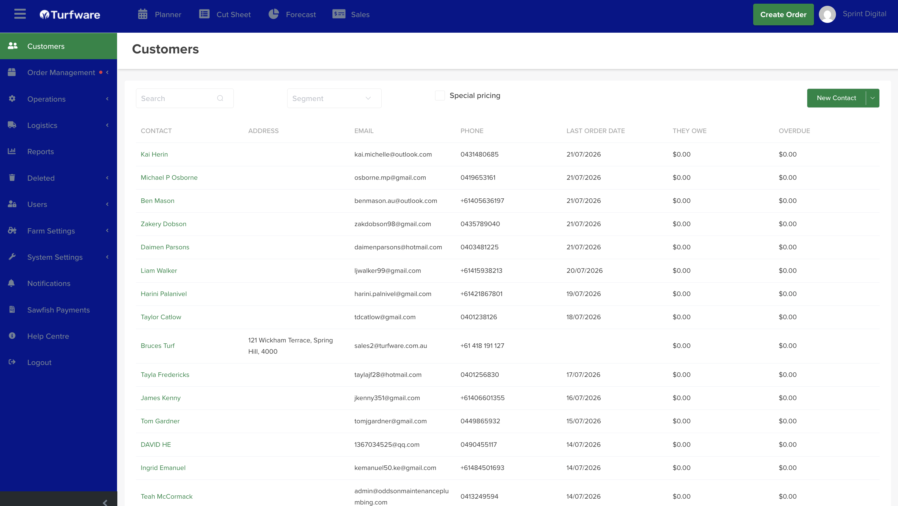
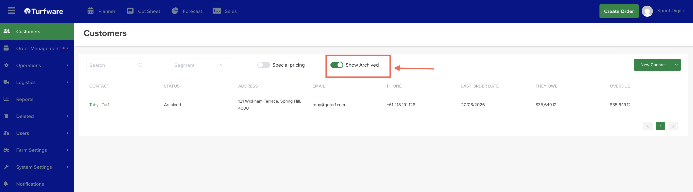

# Customers

Your customer records are the heart of Turfware — every order, price, invoice and document hangs off a customer. This section follows the customer workflow top to bottom.

## Where to find it

Left-hand navigation → Customers.

## The customer list view

The Customers page lists every customer in Turfware. From here you can:

- Search for a customer by name.
- Click any row to open that customer's [summary](customer-summary.md).
- See a customer's status at a glance — the Status column shows Active or Archived.
- **Add a new customer** — the green New Contact button (top right). See [Adding a customer](adding-a-customer.md).

## Active and archived customers

By default the list shows your active customers. When you archive a customer you no longer deal with, they drop off this list but are kept, not deleted — and the Status column marks each row Active or Archived. Flip Show Archived, at the top of the list, to bring archived customers back into view, then Unarchive any you want to restore.

To archive or restore an individual customer, see [Archiving a customer](customer-summary.md#archiving-a-customer).

-   __[Adding a customer](adding-a-customer.md)__

    Create a customer, set organisation type and segment, and clear the duplicate check.

-   __[Customer summary](customer-summary.md)__

    Edit details, add contacts and communication preferences, notes, and open the customer in Sawfish.

-   __[Special pricing](special-pricing.md)__

    Customer-specific rates that override standard pricing.

-   __[Billing](billing.md)__

    Every order, due and overdue balances, at a customer level.

-   __[Documents](documents.md)__

    Store key files against the customer.

