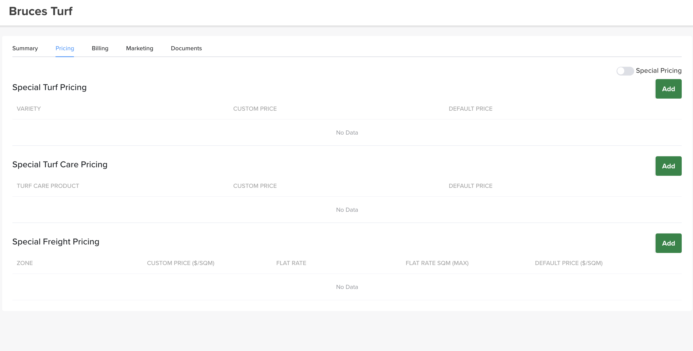

# Special Pricing

The **Pricing** tab is where you set **customer-specific pricing**.

## Where to find it

Open the customer → **Pricing** tab.

!!! warning "This overrides everything"
    Special pricing applies **only to this customer** and **overrides all other price settings in Turfware** (including segment pricing). Use it for negotiated customer rates.

## Turn it on

Special pricing is off by default. Switch the **Special Pricing** toggle **on** (top right of the tab) to activate it.

## Set the prices

With it on, add pricing in three sections — each shows the **Custom Price** against the standard **Default Price**, and each has its own **Add** button:

- **Special Turf Pricing** — a custom price per turf **variety**.
- **Special Turf Care Pricing** — a custom price per **turf care product**.
- **Special Freight Pricing** — a custom freight rate per **zone**: custom **$/SQM**, a **flat rate**, and a **flat-rate SQM (max)**.

Save your changes. From now on, this customer's orders use these rates instead of the standard ones.
