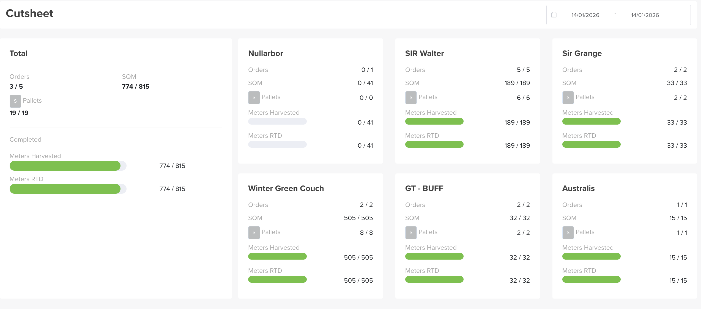

# Cut Sheet

The **Cut Sheet** is a **live window into the Harvesting app** — so Admin and Sales in the web app can see **real-time harvesting activity** without leaving Turfware. As the harvest team cuts and stages turf, the progress bars here fill in.

## Where to find it

Top navigation → **Cut Sheet**.

## Choose your window

Set the **date range** (top right) to the harvest days you want to see.

## The Total card

The first card sums everything for the range:

- **Orders** — completed / total (e.g. `3 / 5`).
- **SQM** — square metres cut / booked (e.g. `774 / 815`).
- **Pallets** — made up / required (e.g. `19 / 19`).
- **Meters Harvested** and **Meters RTD** (Ready To Deliver) — progress bars showing metres harvested and metres ready to deliver against the total.

## Per turf variety

Below the total, each **turf variety** (Nullarbor, SIR Walter, Sir Grange, Winter Green Couch, GT-BUFF, Australis…) gets its own card with the same figures — Orders, SQM, Pallets, and the **Meters Harvested / Meters RTD** progress bars — so you can see exactly which variety is cut and which is still on the harvester.

!!! tip "Read the bars at a glance"
    A **full green bar** means that variety is fully harvested and ready to deliver; a part-filled bar shows how far the harvest team has got, in real time.
