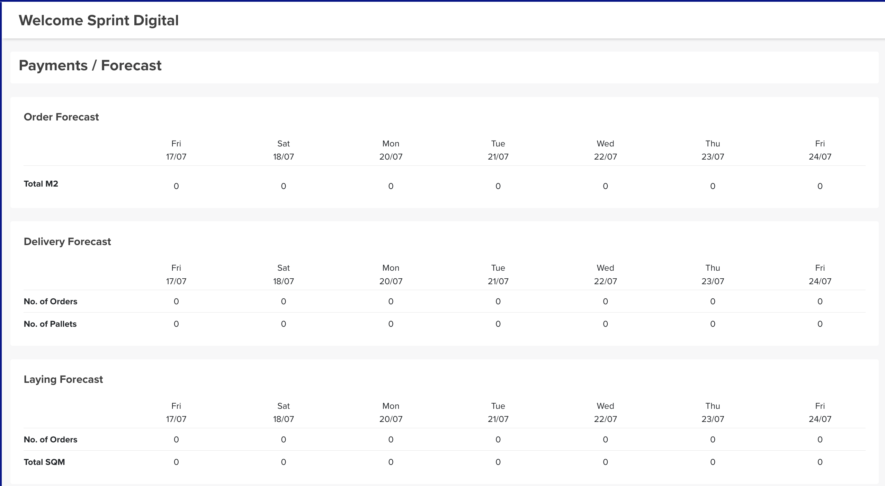

# Forecast

The **Forecast** (headed **Payments / Forecast** in the app) is a short-term, **7-day look ahead** — three tables that show the order, delivery and laying workload coming up, so you can plan harvest, trucks and laying crews against real demand.

## Where to find it

Top navigation → **Forecast**.

## The three forecasts

Each table lists the **coming 7 days across the top** (day and date); the figures run down the side. Where there are orders, they break down by **turf variety**.

- **Order Forecast** — **Total M²** booked per day.
- **Delivery Forecast** — **No. of Orders** and **No. of Pallets** per day.
- **Laying Forecast** — **No. of Orders** and **Total SQM** per day.

!!! tip "Plan the week ahead"
    Read the three together: **Order Forecast** tells you how much turf to cut, **Delivery Forecast** how many trucks and pallets you'll need, and **Laying Forecast** how much installation crew work is booked.
