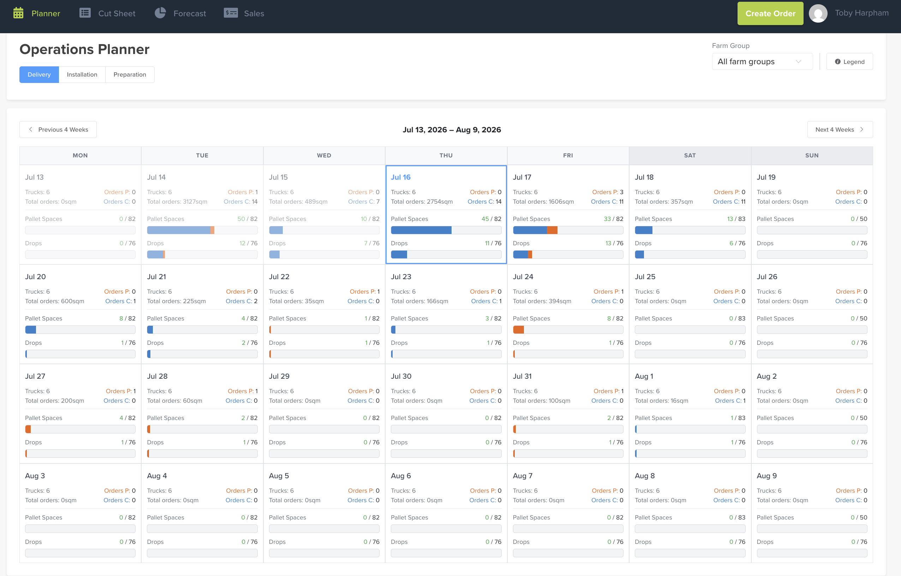

# Planner

The **Planner** (headed **Operations Planner** in the app) is your **forward-looking capacity view**. Across the next four weeks it shows how full each day is — trucks, pallet spaces and drops — alongside how many orders are **pending** vs **confirmed**, so you can plan and manage orders against your real capacity.

## Where to find it

Top navigation → **Planner**.

## The 4-week view

Each day tile shows, at a glance:

- **Trucks** — trucks available that day.
- **Total orders** — total square metres booked.
- **Orders P / Orders C** — orders **Pending** / **Confirmed**.
- **Pallet Spaces** — used / capacity (e.g. `45 / 82`), with a fill bar.
- **Drops** — used / capacity (e.g. `11 / 76`), with a fill bar.

Use **Previous 4 Weeks** / **Next 4 Weeks** to move the window; **today** is highlighted with a blue border. The **Legend** button (top right) explains the bar colours.

## Filter by operation type

Toggle **Delivery / Installation / Preparation** (top left) to see capacity and orders for each operation stream on its own.

## Filter by farm group

Use the **Farm Group** dropdown (top right) to focus on a single farm group, or leave it on **All farm groups**.

## Why use it

It gives you a forward flow of **truck capacity, square metres, and pending vs confirmed orders** in one place — so you can balance load across days and manage orders against what you can actually deliver.

!!! note "Calendar layout — across all of Turfware"
    Every calendar in Turfware uses a clean **Monday–Sunday** layout, with **weekends lightly greyed** so they're easy to pick out at a glance.
