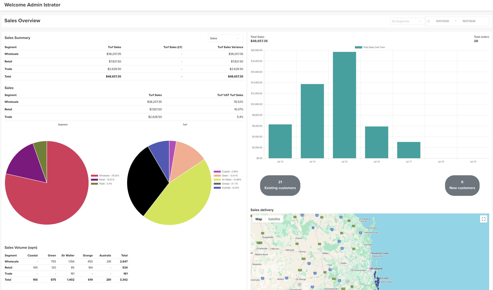

# Sales

The **Sales** dashboard (titled **Sales Overview**) is a **graphical view of your sales data** — filterable by **date range** and **segment** — so you can read performance at a glance.

## Where to find it

Top navigation → **Sales**.

## Filters

- **Segment** — All Segments, or a single segment (Wholesale / Retail / Trade).
- **Date range** — the period to report on.

## What it shows

- **Sales Summary** — by segment: **Turf Sales**, **Turf Sales (LY)** (last year) and the **Variance**, with a total row. A metric dropdown lets you switch what's summarised.
- **Sales** — by segment: Turf Sales and each segment's **% of total** turf sales.
- **Pie charts** — sales split by **Segment** and by **Turf** variety.
- **Total Sales** and **Total orders** for the period.
- **Total Sales Over Time** — a bar chart by day.
- **Existing vs New customers** — counts for the period.
- **Sales delivery** — a map of where orders are going.
- **Sales Volume (sqm)** — square metres by segment and variety, with totals.

