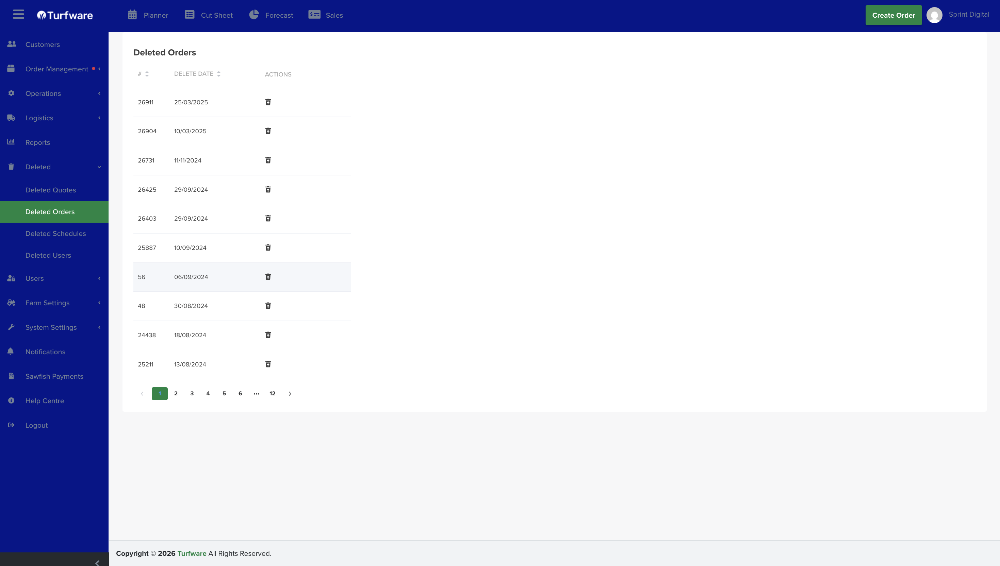

# Restoring Deleted Items

- Find the Item to Restore: Locate the deleted item you wish to restore in the respective section (Quotes, Orders, or Schedules).

- Restore the Item: Click the "Restore" icon in the actions column next to the item you want to recover. The item will be restored and will reappear in its original location.

