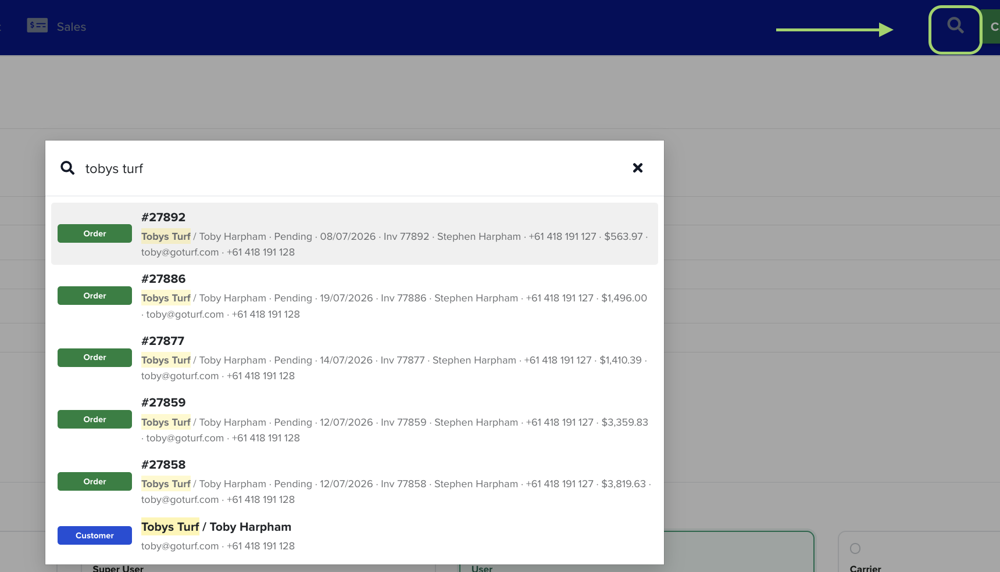

# Global Search

Global Search is the fastest way to get to any record in Turfware. Open it from any screen, start typing, and jump straight to a customer, order, quote, invoice or turf variety — no clicking back through menus and lists to find what you need.

## How to open it

Two ways, from anywhere in the web app:

- Click the **search icon** (the magnifying glass) in the top bar.
- Or press **⌘ K** on a Mac, or **Ctrl + K** on Windows.

## How to use it

1. Open the search box (above).
2. Start typing — you need **at least 2 characters** before results appear.
3. Results update as you type. Click any result to open that record.

You can search by:

- **Customer** — business or contact name.
- **Order** — order number, or the customer on it.
- **Quote** — quote number, or the customer on it.
- **Invoice** — invoice number.
- **PO / reference** — the customer's purchase-order or reference number.
- **Turf variety** — by name.

## Reading the results

Each result is tagged with its type — a green **Order** tag, a blue **Customer** tag, and so on — and shows the key details at a glance: the customer and contact, the status, the date, the invoice number, the contact phone and email, and the order value. The part of the record that matched what you typed is highlighted, so you can see why it came up.

!!! tip "Search instead of scrolling"
    Global Search looks across your whole account in one place, so it's usually quicker than opening a list and filtering — especially when you know the order number, the customer name, or a PO number. Give it a try next time you'd normally head to a list.
