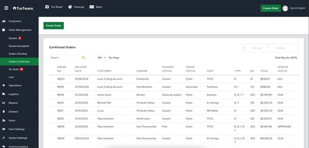
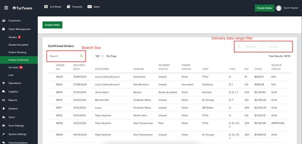
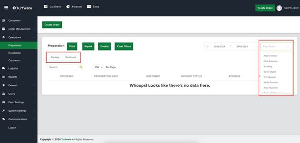

# How to use lists

Most screens in Turfware — orders, quotes, customers, deliveries — are lists. A list shows your records in rows, with a column for each attribute. The Orders Confirmed list, for example, has columns such as Order Number, Delivery Date, Customer, Suburb and Payment Status.

Two habits make lists easy to work with: use sorting and filtering to find what you need quickly, and use pagination rather than scrolling through large sets of records.

## Searching

The search field sits above the list, near the top-left of the section.

- Type the keyword or phrase you want to find — for example a customer name or order number.
- Press the search icon or hit Enter. The list updates to show only the records that match.
- To see all records again, clear the search field and search with an empty input.

## Filtering

Filters narrow the list by specific criteria, such as order status.

- Click a filter — usually a dropdown or checkbox — and choose the criteria you want.
- The list updates to show only the records that match the selected filters.
- To see the complete list again, clear any applied filters.

## Filtering by date

The date range picker sits near the top-right of the list.

- Click the date fields to open a calendar and choose your start and end dates.
- Once both dates are selected, the list refreshes automatically to show records within that range.
- To remove the date filter and see all records, clear the date range.

