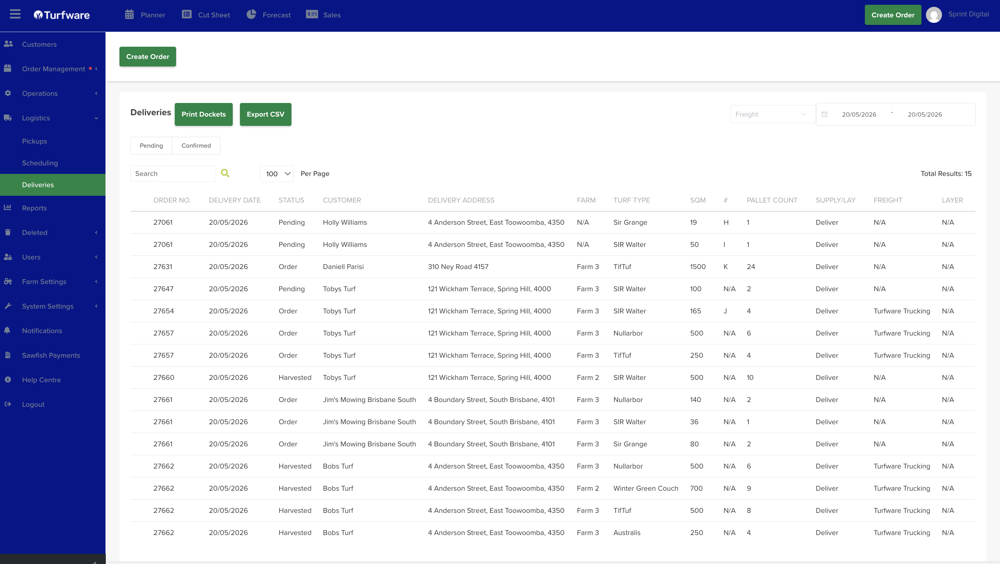

# Export into CSV

The Delivery screen (Logistics → Delivery) lists your deliveries for a date range — you can switch between the Pending and Confirmed tabs, and each row shows the order number, customer, delivery address, delivery date, pallet count and status.

To export the current list, click the green Export CSV button at the top. The filtered table downloads to your machine as a CSV file.

