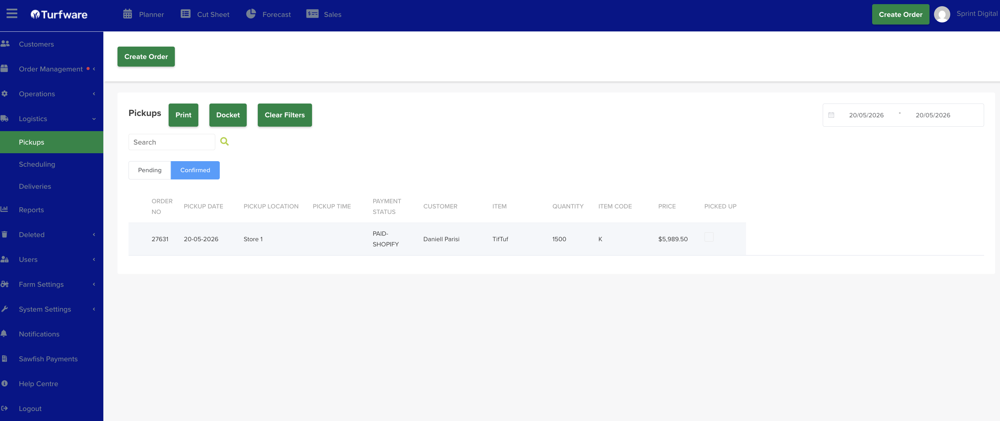

# Pickup

The Pickup screen (Logistics → Pickup) lists orders due for pickup, with a date-range filter, a search box and a Clear Filters button.

## Mark a pickup as collected

Tick the checkbox in the Picked up column of the order that has been collected.

Once an order is marked as picked up, it is locked and its status changes to Picked Up.

## Generate a report

- **Print** — generate the pickup report as a PDF, which opens in a new tab.
- **Docket** — generate a pickup docket.
