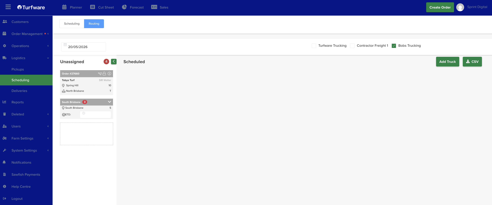
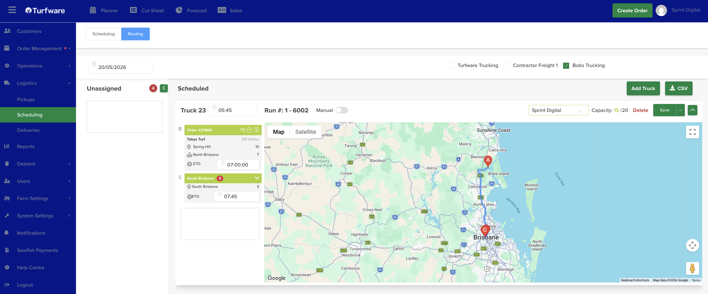

# How to use the routing Feature

Routing is where you build each carrier's truck runs for a day and let Turfware map the route.

## Open Routing

Switch to the blue Routing button (top left) to open the Routing Management page. Pick the date, then tick the carrier(s) you're routing (Turfware Trucking, Bobs Trucking, and so on).

## Assign orders to trucks

- The Unassigned column (left) lists every order for that date and carrier that isn't yet on a truck.
- Click Add Truck to add a truck run — choose the truck and driver.
- Drag an order from Unassigned onto a truck to assign it, and set each drop's ETD as needed.

## Route and save

- Once orders are on a truck, Turfware calculates the run and shows the route on the map (each stop lettered A, B, C…). Each truck shows its Run number and the Capacity used.
- Click Save to save the trucks and generate the docket.
- Click CSV (next to Add Truck) to export the deliveries as a CSV file.

