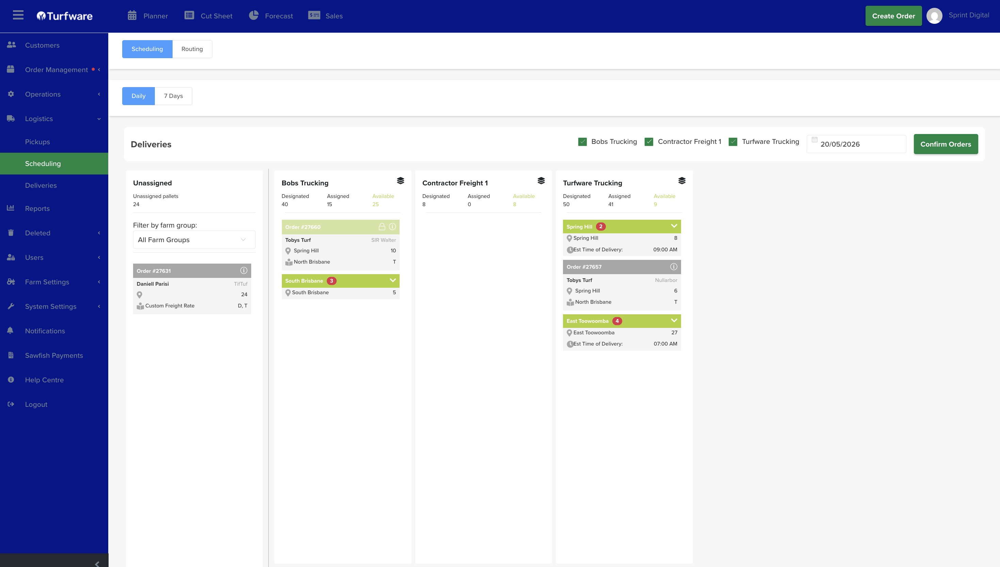

# How to use the scheduler

Users can switch between the “Daily” and “7 Days” tabs.

7 Days tab:

- The section provides a weekly overview of scheduled items, grouped by carriers and dates.

Daily tab:

- On the Schedules Management page, select the delivery date (see figure below) to filter orders that have the selected delivery date.

- A list of delivery companies will be displayed at the top. Tick the checkbox next to a company to display it as a column underneath (see Figure 7.2.1 below).

- The “Unassigned” column lists all orders with the select delivery date that haven’t been assigned to any delivery company.

- To assign an order to a delivery company, drag and drop the unassigned order into the corresponding delivery company’s column.

- Click the green “Confirm Orders” button to confirm the carrier's assigned orders and send an email to the delivery company.

