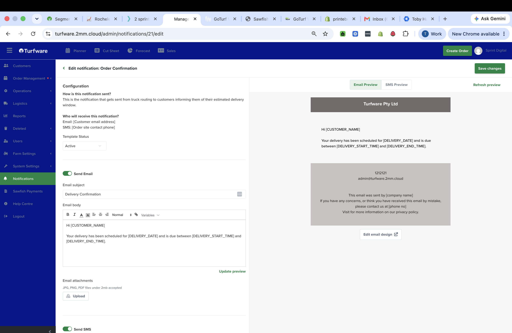

# Editing a notification

Click any template on the [Notifications](index.md) list to open its editor. The left side is the configuration; the right side is a live preview of exactly what the customer receives.

## Configuration

- **How is this notification sent?** — a plain-English note of when the message fires.
- **Who will receive this notification?** — the Email and SMS recipients for this message (for example, Email = the customer's email address; SMS = the order's site-contact phone).
- **Template Status** — Active or Inactive. Set it Inactive to stop this message sending without losing its content.

## Email

- **Send Email** — toggle the email on or off.
- **Email subject** — the subject line; you can insert [variables](variables.md) here too.
- **Email body** — a rich-text editor (bold, italic, colour, alignment, links). Click **Variables** to insert a merge field — see [Variables](variables.md).
- **Email attachments** — attach JPG, PNG or PDF files under 2MB to send with the email.

## SMS

- **Send SMS** — toggle the SMS on or off. The SMS is its own short message — check it under SMS Preview.

## Preview

The right panel shows a live **Email Preview** and **SMS Preview** — what the customer will actually see, with your header, footer and branding, and the variables filled with sample data. Click **Update preview** / **Refresh preview** after editing to refresh it.

## Branding

**Edit email design** (top right, or on the list) opens the shared header, footer and colours applied to every email — your logo, contact details and sign-off.

## Save

Click **Save changes**.
