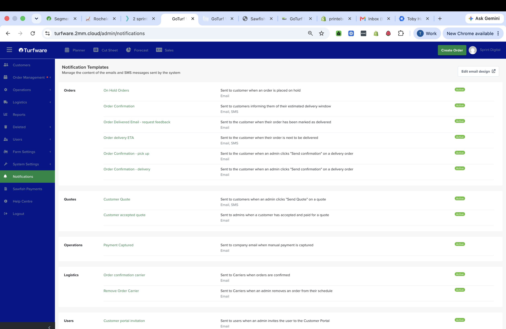

# Notifications

Notifications are the emails and SMS messages Turfware sends automatically as orders move through your workflow — confirmations, delivery ETAs, quotes, carrier notices and more. The Notifications area is where you manage what each message says, whether it goes by email or SMS, and who receives it.

## Where to find it

Left-hand navigation → Notifications.

## The Notification Templates list

Every message the system can send, grouped by area — Orders, Quotes, Operations, Logistics and Users. Each row shows a short description, whether it's Email, SMS or both, and its status (Active / Inactive). Click a template to open its [editor](editing-a-notification.md). Edit email design (top right) sets the shared header, footer and colours applied across every email.

## What each notification is, and who it goes to

### Orders

| Notification | Channel | Goes to | When |
|---|---|---|---|
| **Order Confirmation** | Email + SMS | Customer (email); order site contact (SMS) | A delivery is scheduled in truck routing — tells the customer their estimated delivery window |
| **Order Confirmation – delivery** | Email | Customer | An admin clicks Send confirmation on a delivery order |
| **Order Confirmation – pick up** | Email | Customer | An admin clicks Send confirmation on a pick-up order |
| **Order delivery ETA** | Email + SMS | Customer | The order is next to be delivered (driver on the way) |
| **Order Delivered Email – request feedback** | Email | Customer | The order is marked delivered — invites a review / feedback |
| **On Hold Orders** | Email | Customer | An order is placed on hold |

### Quotes

| Notification | Channel | Goes to | When |
|---|---|---|---|
| **Customer Quote** | Email + SMS | Customer | An admin clicks Send Quote on a quote |
| **Customer accepted quote** | Email | Your staff (internal) | A customer accepts and pays for a quote |

### Operations

| Notification | Channel | Goes to | When |
|---|---|---|---|
| **Payment Captured** | Email | Your company email (internal) | A manual payment is captured |

### Logistics

| Notification | Channel | Goes to | When |
|---|---|---|---|
| **Order confirmation carrier** | Email | Carrier | Orders are confirmed — tells the delivery company |
| **Remove Order Carrier** | Email | Carrier | An admin removes an order from their schedule |

### Users

| Notification | Channel | Goes to | When |
|---|---|---|---|
| **Customer portal invitation** | Email | The invited user | An admin invites them to the Customer Portal |

!!! tip "Turn one off without deleting it"
    Set a template's status to Inactive to stop it sending while keeping its content — see [Editing a notification](editing-a-notification.md).
