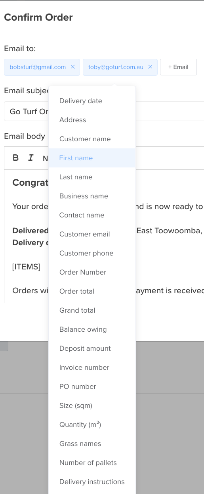

# Variables (merge fields)

A variable is a placeholder you drop into an email or SMS — like `[FIRST_NAME]` or `[ORDER_NUMBER]` — that Turfware swaps for the real value when the message sends. In the body (or subject), click the **Variables** dropdown and choose one to insert it.

Each template offers the variables that make sense for it, so the list you see changes from one notification to the next. The Variables dropdown always shows the fields available for the template you're editing — it's the best source of truth, and clicking one inserts it for you.

## Customer name

Greet customers naturally and show the business name where you need it:

- `[FIRST_NAME]` — the customer's first name (e.g. "Hi Sarah,").
- `[LAST_NAME]` — their last name.
- `[BUSINESS_NAME]` — the business name on its own.
- `[CONTACT_NAME]` — first and last name together (a person, never the business).
- `[CUSTOMER_NAME]` — the customer's display name (kept for existing templates).
- `[CUSTOMER_EMAIL]` — the customer's email address.
- `[CUSTOMER_PHONE]` — the customer's phone number.

## Order & delivery

- `[ORDER_NUMBER]` — the order number.
- `[DELIVERY_DATE]` — the scheduled delivery date.
- `[DELIVERY_START_TIME]` / `[DELIVERY_END_TIME]` — the delivery window.
- `[ETA_FROM]` / `[ETA_TO]` — the live "on the way" ETA window.
- `[DELIVERY_ADDRESS]` — the delivery address.
- `[SITE_CONTACT]` / `[SITE_CONTACT_NO]` — the on-site contact name and phone.
- `[GRASS_NAMES]` — the turf varieties on the order.
- `[SIZE_SQM]` — total square metres ordered.
- `[NUMBER_OF_PALLETS]` — pallet count.
- `[PO_NUMBER]` — the customer's purchase-order number.
- `[DELIVERY_INSTRUCTIONS]` — the delivery notes for the customer.
- `[ITEMS]` — the itemised order lines.

## Money & payment

- `[ORDER_TOTAL]` — the order total (inc GST).
- `[GRAND_TOTAL]` — the grand total for the whole order (inc GST).
- `[BALANCE_OWING]` — how much is still owed.
- `[AMOUNT_PAID]` / `[AMOUNT_DUE]` — amounts paid and due.
- `[INVOICE_NUMBER]` — the invoice number.
- `[PAYMENT_LINK]` — a click-to-pay link for the invoice.
- `[DEPOSIT_PERCENT]` / `[DEPOSIT_AMOUNT]` — deposit as a percentage or a dollar amount.
- `[PAYMENT_TERMS]` — the customer's payment terms.

## Quotes

- `[QUOTE_NUMBER]` / `[QUOTE_DATE]` — the quote number and date.
- `[ACCEPT_QUOTE_LINK]` — the accept-and-pay-deposit button.

## Delivery & logistics

- `[DRIVER_NAME]` / `[DRIVER_PHONE]` — the driver's name and phone.
- `[CARRIER_NAME]` — the carrier (delivery company).

## Your business

- `[ORG_NAME]` — your business name.
- `[ORG_CONTACT_NO]` — your business phone.
- `[ACCOUNTS_EMAIL]` — your accounts-team email.
- `[GOOGLE_URL]` — your Google review link (as a button).

!!! tip "Preview before you save"
    After inserting variables, use the Email / SMS Preview on the right to check the message reads correctly — the preview fills every variable with real sample data.
