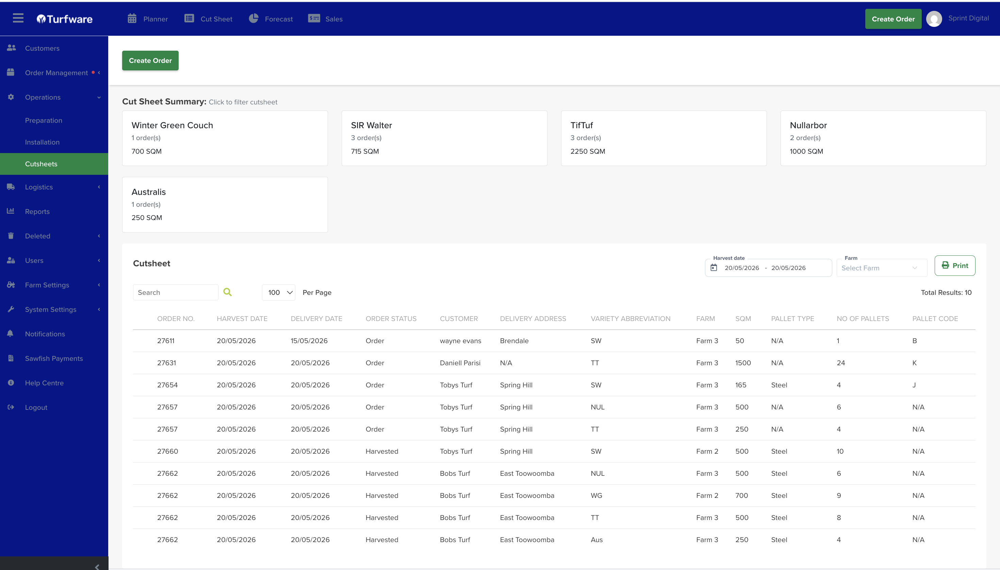

# Cutsheets

The Cutsheet report is a printable list of what the harvest team needs to cut.

!!! note "Not the same as the Dashboard Cut Sheet"
    This is the Operations **report**. The Dashboard [Cut Sheet](../dashboard/cut-sheet.md) is the live, on-screen view of harvest progress. Same source, different job.

## Where to find it

Left-hand navigation → Operations → Cutsheet.

## Cut Sheet Summary

Across the top, a card for each turf variety in the range shows its order count and total SQM. Click a variety card to filter the list below to just that variety.

## Filters

- **Harvest date** — the date (or range) to report on.
- **Farm** — optionally narrow to a single farm.
- **Search** — find a row by order number, customer, and so on.

## The list

Each row shows the order number, harvest and delivery dates, order status (Order / Harvested), customer, delivery address, turf variety, farm, SQM, pallet type, number of pallets and pallet code.

## Actions

- **Print** — open the report as a PDF to print.

