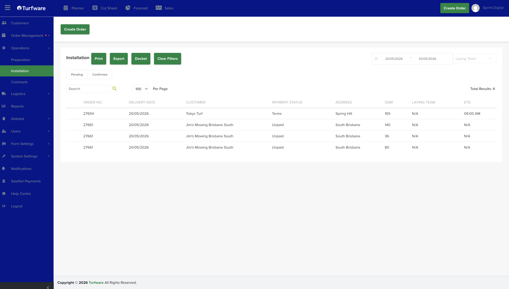

# Installation

The Installation report lists the orders that have laying (installation) work, ready to print, export or send as a docket.

## Where to find it

Left-hand navigation → Operations → Installation.

## Filters

- **Date range** — the period to report on.
- **Order status** — the Pending / Confirmed tabs.
- **Laying team** — optionally filter by the laying team handling the job.
- **Search** — find a row by order number, customer, and so on.

## The list

Each row shows the order number, delivery date, customer, payment status, address, SQM, laying team and ETD (estimated time of delivery).

## Actions

- **Print** — open the report as a PDF to print.
- **Export** — download the report as an Excel file.
- **Docket** — generate a docket for the job.
- **Clear Filters** — reset all filters to the default view.

