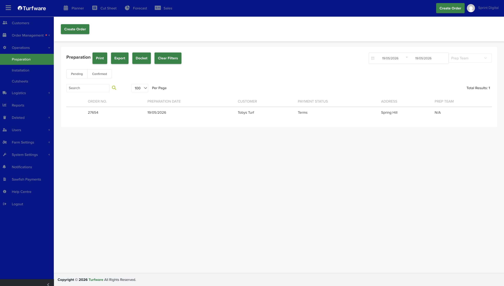

# Preparation

The Preparation report lists the orders that need prep work, ready to print, export or send as a docket.

## Where to find it

Left-hand navigation → Operations → Preparation.

## Filters

- **Date range** — the period to report on.
- **Order status** — the Pending / Confirmed tabs.
- **Prep team** — optionally filter by the prep team handling the job.
- **Search** — find a row by order number, customer, and so on.

## The list

Each row shows the order number, preparation date, customer, payment status, address and prep team.

## Actions

- **Print** — open the report as a PDF to print.
- **Export** — download the report as an Excel file.
- **Docket** — generate a docket for the job.
- **Clear Filters** — reset all filters to the default view.

