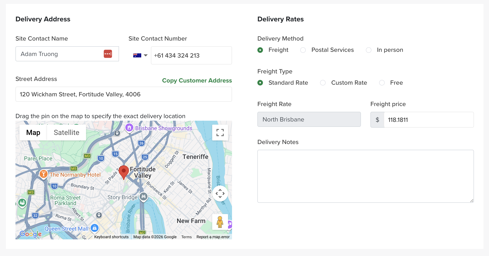

# Creating & Managing an Order

The Order page is where an order is built, saved, moved through your workflow, and invoiced. It has four tabs — **Order Summary**, **Timeline**, **Documents** and **Invoicing** — and a **Status** control and **⋯ actions** menu in the top right.

This guide follows the full flow: building the order on the **Order Summary** tab, saving it, moving it through the workflow, and the key actions.

*[Screenshot: Order page header — the four tabs, Status dropdown and ⋯ menu]*

## The Order Summary tab

### Customer Account Status

Shows the customer's current **account status against their credit limit** and their **invoice status**. It becomes active once a customer has been entered in Order Detail (below).

### Order Detail

- **Customer** — search across *all* customers in Turfware. The search returns the customer / business name **and** address, so you can tell two "John Smith"s apart. If the customer isn't a **Sawfish client** yet, you can create one from here so their invoices sync to your accounts.
- **Segment & Sales Person** — if these are set on the customer's profile they're pre-filled; otherwise fill them in.
- **PO** — a free-text field. If you complete it, it becomes the **reference field on the invoice**, so the customer can match the invoice to their PO. If the customer supplied a PO document, attach it under the **Documents** tab for reference.
- **Market Channel** — where the customer came from. Helps you understand which marketing channels are working.

### Sales Type

How the order is fulfilled. Choosing a type reveals the matching section.

=== "In-store sale"
    A walk-in sale of **stock on hand** — e.g. fertiliser off the shelf, turf on display. This is a **lite order**: it does **not** enter the order workflow.

=== "Pickup"
    The order is **collected** at a location (set up in **Farm Settings → Pickup Locations**). Depending on how that location is configured, the order may or may not enter your logistics flow.

    Selecting Pickup reveals the **Pickup** section — complete **Contact Name**, **Contact Number**, **Pick Up Location**, **Pickup Time** and **Pickup Date**. This generates the pickup on the **Pickup list** (Logistics → Pickup).

    *[Screenshot: Pickup Details section]*

=== "Delivery"
    A **Delivery date** is required — the date the order is to be delivered. The **Delivery** section appears:

    - **Site Contact Name & Number** — important: the site contact receives an **SMS with the delivery time** once runs are locked in, and appears on the **driver app** for drivers to call if needed.
    - **Delivery Address** — copy it from the contact card or enter it manually. It's linked to Google Maps — drag the pin to set the exact delivery location.
    - **Delivery Rates** — auto-filled from your **Freight Rate settings** (Farm Settings → Freight Rates), by postcode. Switch to a custom rate to adjust or override. Use the **Freight price** toggle to show freight on the invoice as a **flat rate** or a **$/m²** rate.
    - **Delivery Notes** — a heads-up for the driver, e.g. *"Call Shawn on arrival, long driveway and he'll meet you out front."* Shows on the driver app.

    

### Products & Services

What's available here is set by **Company Settings → Order Settings** — only the products and services you've enabled appear.

=== "Turf"
    A **Harvest date** is required — the date the turf appears in the **Harvest app** to be cut for this order. It **doesn't** need to match the delivery date (e.g. cut the day before, deliver the next day).

    Opens the **Turf** section, where you select the turf varieties for the order. Turfware handles **multiple varieties per order** — the workflow splits for the harvesters but the order always keeps one unique order number. For each variety, select the **farm** it's harvested from and the **SQM**; the rest pre-fills from your **Turf settings** and the **customer's segment**. Select the **harvesting pallet type**.

    **Cutsheet notes** — notes for the harvest team, e.g. *"display home order."*

    *[Screenshot: Harvesting section]*

=== "Product"
    Select the **product**, the **stock location** (if the product is linked to Shopify for inventory management) and the **units**. The rest pre-fills from the product's setup.

=== "Installation"
    Pre-calculates from the **laying rates** on the customer's segment. You can also set a **custom** installation price. As with freight, choose how it appears on the invoice — **flat rate** or **$/m²**.

    The key difference from other services: you select the **installation supplier** (set up in **Farm Settings → Suppliers**).

    *[Screenshot: Installation section]*

=== "Services"
    Services you provide that may happen on a **different date** to the turf or product delivery — e.g. preparation or maintenance. Because of that, a service has its **own date**, which triggers its **own workflow**: setting a service date populates it on **Operations → Preparations**. Otherwise it works like a product, pulling from **Farm Settings → Services**.

### Order Summary

The order value, calculated **line by line**, replicating the invoice values. Apply a **discount as a field on any line item** — the same way Xero, MYOB and Shopify do it (e.g. 25% off a product). The discount shows on the invoice, so the customer can see it applied.

## Saving the order

!!! warning "An order must be saved to be captured"
    Click **Save changes**. On save, the order defaults to **Pending**. **Pending orders don't appear in any workflow** (harvest, delivery) yet.

## Moving the order through the workflow

To move an order into the workflow, change the **order Status** in the top-right of the order (Pending → Confirmed). Depending on your admin settings, there may be a blocker.

!!! note "Require Payment Before Confirmation"
    Set under **System Settings → Company Information → Order Workflow**. When enabled, it's a **hard-stop** preventing Pending → Confirmed unless payment criteria are met — protecting you from harvesting turf for orders that won't be paid.

    An order may be confirmed when **any** of these is true:

    - the order is marked **Paid**, or
    - a payment has been recorded via **Receive Payment (Manual)**, or
    - the customer has active **Account Terms** *and* the order is within their **credit limit** (total outstanding invoices &lt; credit limit).

    **Administrator override** — only an Administrator can force-confirm an unpaid order. This triggers an *"Order Not Paid"* confirmation popup, and the override is recorded in the order **Timeline**.

!!! tip "Recording a payment"
    Any **user or super-user can record a payment** on an order at **any time** (via **Received Payment**) — there's no cut-off-time restriction, so you don't need manager permission to mark an order paid.

## Order actions (the ⋯ menu)

The key actions live in the **⋯ menu** in the top-right of the order.

### Send confirmation

Sends an **email confirmation** of the order to the customer. We recommend sending it — it provides a validation of the order confirmation. It's a **template** you can customise (Notifications → *Order Confirmation*). A popup appears, pre-filled with that order's information; add email addresses and adjust the wording to suit.

### Put on hold

Takes the order **out of the workflow**, saves all its information, and stores it on its own list (**Orders → On Hold**) to come back to. Typically used for rain delays, site delays, etc. — the order may even be paid, but is on hold operationally. When it's ready, move it back: by default it returns to **Orders Pending** so you can update the harvest and delivery dates.

While an order is on hold, an **On Hold** badge shows on the order (next to the lock icon), so its status is clear at a glance.

### Generate invoice

Generate and send the customer's invoice. There are **three decisions**:

1. **Invoice date** — defaults to today's date; adjust if required.
2. **Due date** — auto-populates from the customer's payment terms. No terms → due date = invoice date; 14-day terms → due date = invoice date + 14. You can also set it manually.
3. **Generation option** — **Draft**, **Approve Only**, or **Approve & Send** (matching Sawfish). Only **Approve & Send** emails the invoice to the customer now. **Draft** and **Approve Only** generate the invoice **without sending** — send it later from the **Invoicing** tab, where you can also **view** and **print** it.

*[Screenshot: Generate invoice modal]* · *[Screenshot: Invoicing tab — Approve and Send]*

!!! tip "Where invoices live"
    Every invoice for an order is listed on its **Invoicing** tab — showing invoice number, Sawfish status, invoice status, amount paid and amount due — with **Approve and Send / Approve Only / View / Print** actions.
