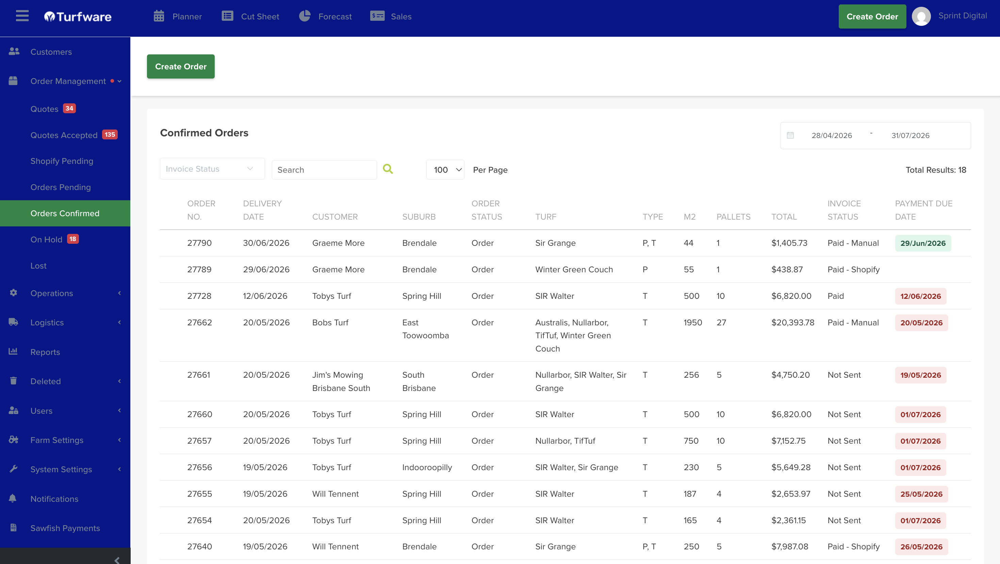

# Order Management

Order Management is where every order lives, from first quote to a confirmed job on the trucks. This section follows the **order lifecycle** — the same statuses you see in the left-hand menu.

## Where to find it

Left-hand navigation → **Order Management**.

## The order lifecycle

An order moves through these statuses (each is its own list in the menu):

1. **[Quotes](quotes.md)** — a priced proposal, before it's an order.
2. **[Quotes Accepted](quotes-accepted.md)** — the customer has accepted (and often paid a deposit).
3. **[Shopify Pending](shopify-pending.md)** — orders that came in from your Shopify store, waiting to be actioned.
4. **[Orders Pending](orders-pending.md)** — created but not yet confirmed; sits outside the operational workflow.
5. **[Orders Confirmed](orders-confirmed.md)** — confirmed and pushed into harvest, delivery and laying.
6. **[On Hold](on-hold.md)** — paused and pulled out of cutsheets and delivery runs.
7. **[Lost](lost.md)** — cancelled or abandoned; closed and kept for reporting.

To build an order from scratch, see **[Creating & Managing an Order](creating-and-managing-an-order.md)**.

## The orders list

Each status opens a filtered list of orders. The list shows, per order: **Delivery Date, Customer, Status, Payment Status, Invoice Sent, Delivery Address, Turf Type, Size m², Turf Price, Supply/Lay, Freight, Pallet Count, Layer** and **Invoice No**.

Narrow it with the filters along the top — **date range, Turf Type, Order Status, Payment Status, Hide Invoiced Orders** and **Search a Customer** — then **Print** the result if you need a hard copy.

