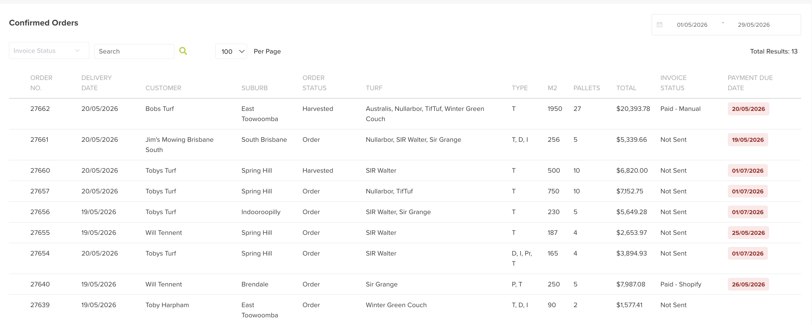

# Orders Confirmed

Orders Confirmed are orders that have passed the confirmation step. Confirming an order is the moment it becomes a real job.

## Where to find it

Left-hand navigation → Order Management → Orders Confirmed.

The list shows each confirmed order at a glance — order number, delivery date, customer, suburb, order status, turf, m², pallets, total, invoice status and payment due date. Filter by invoice status or a date range, or search to find a specific order.

## What confirming triggers

Once an order is confirmed, the operational workflow starts and the order becomes visible across all the connected apps:

- the Admin web app (planner, cutsheets, delivery runs),
- the Cutting / Harvest app, and
- the Delivery app.

This is what keeps operations and data in sync — harvest knows what to cut, drivers know what to deliver.
