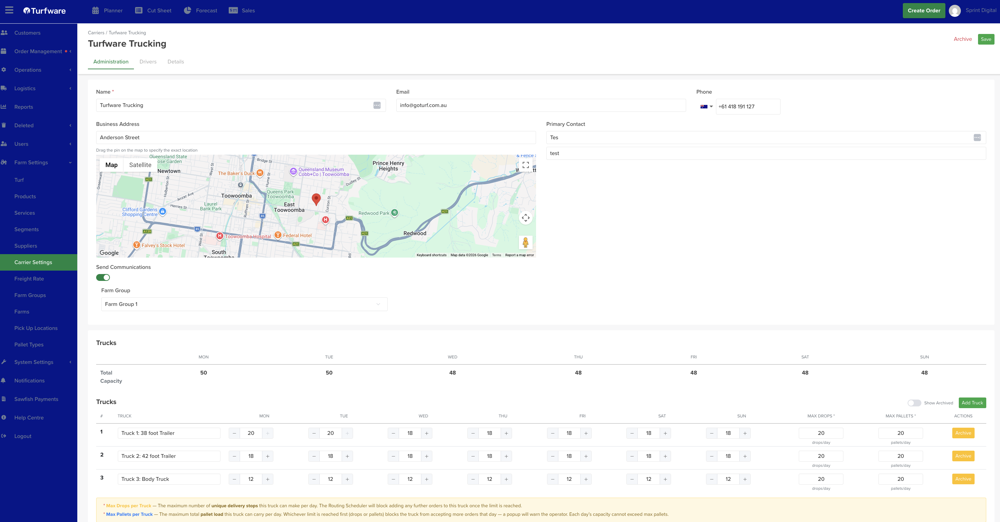
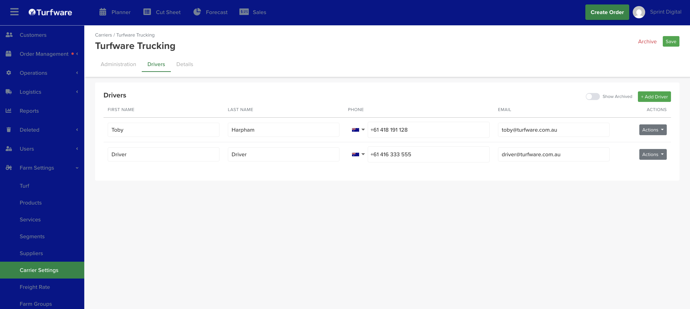

# Carrier Settings

**Carriers** are your **delivery companies** — your own fleet or third-party freight providers. A carrier record sets up who they are, their **trucks** (which drive delivery capacity), and their **drivers**. Each carrier page has three tabs: **Administration**, **Drivers** and **Details**.

## Where to find it

Left-hand navigation → **Farm Settings → Carrier Settings**. Click **Create** to add a carrier, or click a row to edit.

## Administration tab

The carrier's details and its trucks.

### Details

- **Name** *(required)*, **Email**, **Phone**.
- **Business Address** — with a Google map; drag the pin to set the exact location.
- **Primary Contact** — the contact's **name** and **role**.
- **Send Communications** — when **on**, Turfware **emails the carrier** (at the email above) whenever you assign orders to them for delivery, and those orders flow onto their **delivery schedule and route**.
- **Farm Group** — the carrier's **primary** farm group. (You can link a carrier to more groups from [Farm Groups](farm-groups.md).)

### Trucks

Add the carrier's trucks — this is what drives **delivery-scheduling capacity**. Click **Add Truck**, name each truck, and set:

- **Per-day capacity (Mon–Sun)** — the pallet spaces that truck offers each day. If it doesn't run on a day, leave that day at **0** and it won't offer pallet spaces for scheduling. The **Total Capacity** row sums all trucks per day.
- **Max Drops** — the maximum **unique delivery stops** the truck can make per day. The Routing Scheduler blocks more orders once the limit is reached.
- **Max Pallets** — the maximum **pallet load** per day. Whichever limit is reached first — drops or pallets — blocks more orders that day (a popup warns the operator). A day's capacity can't exceed Max Pallets.
- **Archive** a truck to hide it; flip **Show Archived** to see and reactivate archived trucks.

## Drivers tab

A **separate tab** for the carrier's drivers. Click **Add Driver** and enter **First name, Last name, Phone** and **Email** — the **phone and email are where that driver's communications are sent**. **Archive** a driver who no longer drives (flip **Show Archived** to see and reactivate them).

## Details tab

Holds additional carrier information. *(The two tabs above cover day-to-day setup.)*
