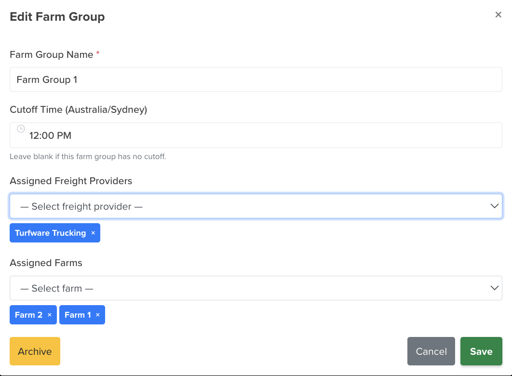

# Farm Groups

Farm Groups bundle farms and carriers together under one name, with a daily cutoff time. Grouping lets you organise capacity and logistics — and filter by group on the [Planner](../../dashboard/planner.md).

## Where to find it

Left-hand navigation → Farm Settings → Farm Groups. Click Create to add a group, or click a row to edit.

## Setting up a group

- **Name** — the group name *(required)*.
- **Cutoff time** — the daily order cutoff for the group.
- **Farms** — the [farms](farms.md) that belong to this group.
- **Carriers** — the [carriers](carrier-settings.md) (delivery companies) assigned to this group.

## Archiving

Retire a farm group you no longer use by Archiving it — it's hidden from the list and from Planner grouping, but kept (not deleted). Flip Show Archived on the list to see archived groups, and Unarchive to bring one back.

The Archive action and Show Archived toggle work the same across these records — see [Archiving a customer](../../customers/customer-summary.md#archiving-a-customer) for a picture.
