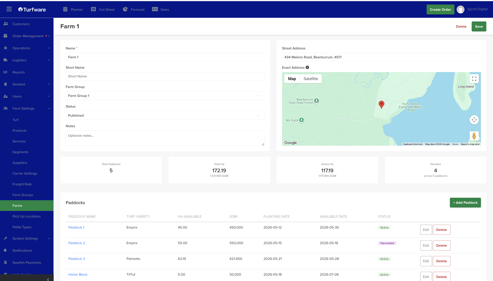

# Farms

**Farms** are the properties where your turf is grown and harvested. Each farm holds its location and its **paddocks** — the blocks where each turf variety is recorded.

## Where to find it

Left-hand navigation → **Farm Settings → Farms**. Click **Create** to add a farm, or click a row to edit.

## Farm details

- **Name** *(required)*, **Short Name**, **Status** (set **Published** to use it), and **Notes**.
- **[Farm Group](farm-groups.md)** — the group this farm belongs to.
- **Street Address** and **Exact Address** — with a Google map; drag the pin to set the precise location.

At a glance the farm shows **Total Paddocks**, **Total Ha** (and m²), **Active Ha**, and the number of **Varieties** across its paddocks.

## Paddocks

A farm's turf is recorded by **paddock**. Click **Add Paddock** and set:

- **Paddock Name**.
- **Turf Variety** — the [turf](turf-varieties.md) grown in this paddock.
- **Ha Available** and **SQM**.
- **Planting Date** and **Available Date** — when it was planted and when it's ready to harvest.
- **Status** — **Active**, **Fallow** or **Harvested**.

Edit or delete a paddock from its row. Paddocks feed the farm's totals and give you a variety-by-variety view of what's growing and when it's available.
