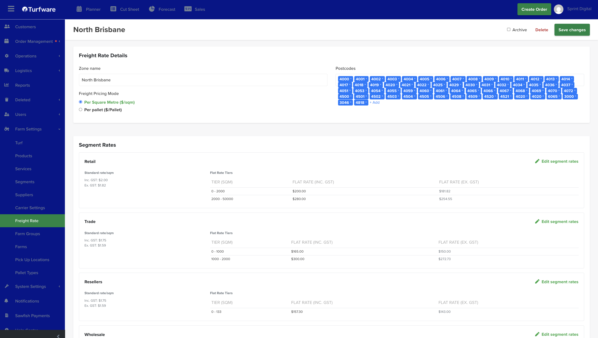

# Freight Rate

Freight Rates are your delivery zones and their prices. Turfware works off Google Maps and postcode recognition — you define each zone by the postcodes it covers, so when a delivery address falls inside a zone, Turfware auto-fills the freight price on the order.

## Where to find it

Left-hand navigation → Farm Settings → Freight Rate. Click Create to add a zone, or click a row to edit.

## Zone details

- Zone name — e.g. *North Brisbane*.
- Postcodes — the postcodes this zone covers, added as chips. This is how Turfware matches a delivery address to the zone.
- Freight Pricing Mode — price the zone Per Square Metre ($/sqm) or Per pallet ($/Pallet).

## Segment rates

Set the price for each [segment](segment.md) (Retail, Trade, Resellers, Wholesale…). Each segment has:

- a Standard rate per m² (shown inc and ex GST), and
- Flat Rate Tiers — a flat freight price by order-size band (e.g. 0–2000 m² = $200, 2000–50000 m² = $280).

Click Edit segment rates to change a segment. On an order, the matching zone plus the customer's segment set the Delivery Rates, which you can still override per order.

