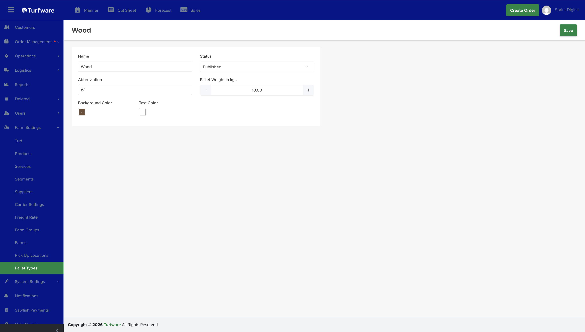

# Pallet Types

Pallet Types are the pallet options available when harvesting an order (e.g. *Steel*, *Wood*). They feed the harvesting pallet type on a turf line and the pallet counts on the [Planner](../../dashboard/planner.md) and [Cut Sheet](../../dashboard/cut-sheet.md).

## Where to find it

Left-hand navigation → Farm Settings → Pallet Types. Click Create to add one, or click a row to edit.

## Setting up a pallet type

- Name (e.g. *Wood*) and Abbreviation (e.g. *W*) — the abbreviation is used in the apps and on cutsheets.
- Pallet Weight in kgs — the pallet's own weight, used in load and weight calculations.
- Status — set Published to use it.
- Background Color / Text Color — the colours the pallet type displays in, so it's easy to spot at a glance.

