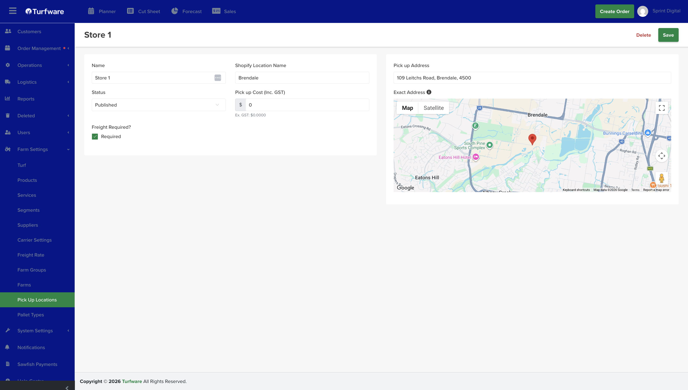

# Pick Up Locations

Pick Up Locations are the places customers can collect an order from — for example *Store 1* or *Main Farm*. They appear in the Pickup section when you build a Pickup order.

## Where to find it

Left-hand navigation → Farm Settings → Pick Up Locations. Click Create to add one, or click a row to edit.

## Setting up a location

- **Name** — the location name *(required)*.
- **Location** — the address of the pickup point.
- **Freight required** — mark this for a non-farm pickup point that still needs the order transported from the farm. When set, the order is added to the freight and scheduling queue so the turf is moved from the farm to the pickup site.

## Archiving

Retire a pick-up location you no longer use by Archiving it — it's hidden from the list and no longer available to select on new orders, but kept (not deleted). Flip Show Archived on the list to see archived records, and Unarchive to bring one back.
