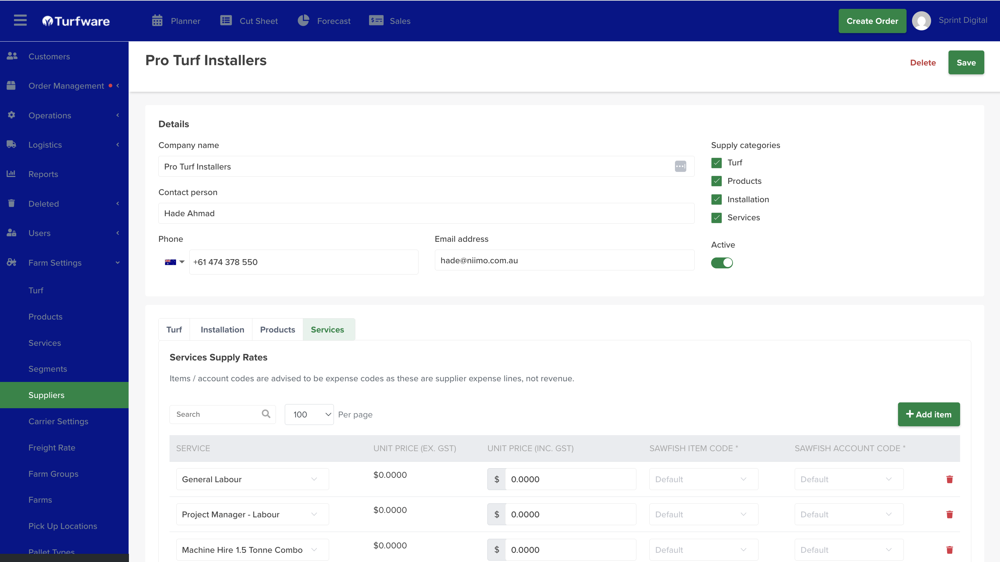

# Suppliers

Suppliers are the businesses that provide **turf, products, installation or services** to you. Setting a supplier up lets you attach them to an order (for example, the installation supplier on a job) and — soon — generate a **purchase order (PO)** from Turfware that maps straight into your accounting system.

## Where to set them up

Go to **Farm Settings → Suppliers**. Click **Create Supplier** to add a new one, or click any row to edit an existing one.

## 1. Details

Complete the supplier's details — **Company name**, **Contact person**, **Phone**, **Email** — and switch **Active** on.

Then tick the **Supply categories** the supplier provides to your business: **Turf**, **Products**, **Installation** and/or **Services**. Ticking a category reveals its matching **tab** lower down the page.

## 2. Supply rates — one tab per category

For each category you ticked, its tab shows a **Supply Rates** table. Complete a line for each item the supplier provides:

- **Item** — pick it from the dropdown. These are your existing **Turf varieties, Products and Services**, so set those up first. See [Turf Varieties](turf-varieties.md), [Products](products.md) and [Services](services.md).
- **Price** — the supplier's rate: **Unit Price** (ex-GST and inc-GST), or **Price / SQM** on the Turf tab.
- **Sawfish Item Code** and **Sawfish Account Code** — the accounting mapping for that line, so a PO generated from Turfware posts to the right item and account. *(PO generation is a feature coming soon.)*

Use **Add item** for more lines.

!!! warning "Use expense codes"
    These are **supplier expense lines, not revenue** — so the Sawfish **item and account codes should be expense codes**, not your sales/income accounts.

The **Installation** supplier you set up here is the one you then select in an order's **Installation** section — see [Creating & Managing an Order](../../order-management/creating-and-managing-an-order.md).

## Save

Click **Save**. The supplier is now available to attach to orders (and to future POs) for the categories you set up.

!!! tip "Set the catalogue up first"
    Because the tabs pull from your Turf, Products and Services, create those first — otherwise the dropdowns will be empty.
