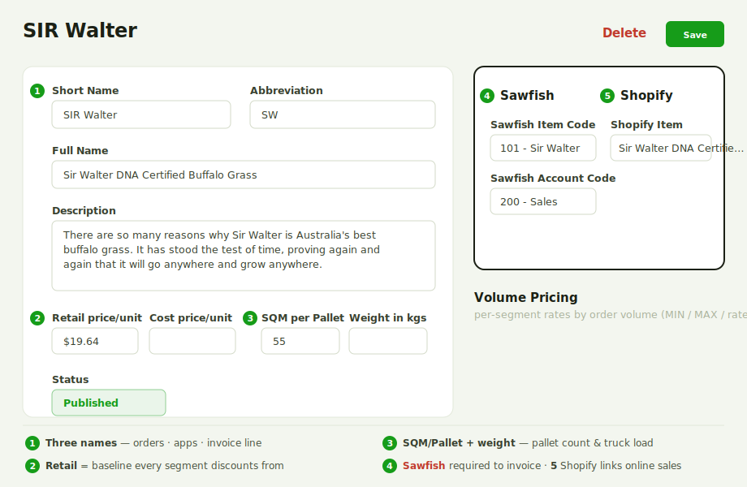

# Turf Varieties

A turf variety is a grass you sell. Each one holds its names, pricing, pallet and weight figures, accounting links and volume pricing — so that once it's set up, it flows correctly through orders, cutsheets, delivery and invoicing.

## Where to set them up

Go to **Farm Settings → Turf**. Click **Create Grass** to add a new variety, or click any row to edit an existing one.

## 1. Naming

A variety has three names, each used in a different place — so it reads clearly for staff, for drivers, and for customers:

- **Short Name** — the name shown **on orders**. Keep it short (e.g. *Sir Walter*).
- **Abbreviation** — the shorthand shown in the **mobile apps** (Delivery & Cutting), where space is tight.
- **Full Name** — used on **invoice line items**; what the customer sees on their invoice (e.g. *Sir Walter DNA Certified Buffalo Grass*).

## 2. Description

Internal notes about the turf — characteristics, care, ideal use. For **your team only**; not shown to customers.

## 3. Price settings

- **Retail Price** — your full retail sell price. The **baseline** every other segment is discounted from.
- **Cost Price** — what the turf costs you (production cost, or wholesale purchase price if bought in). Used for margin reporting.

## 4. Pallet & weight

- **SQM per Pallet** — how many square metres fit on a pallet. **Drives the pallet count** on every order.
- **Weight (kg) per SQM** — average weight of one square metre. Used to calculate **pallet weights** and **total truck load weight** for scheduling.

## 5. Status

- **Draft** — still being set up; does not appear on orders.
- **Published** — live and available to sell.
- **Disabled** — hidden from new orders but kept on record.
- **Delete** — removes the variety.

## 6. Sawfish settings (required for invoicing)

!!! warning "Required for invoicing"
    These fields link the variety to your accounting system. If they aren't completed, **Turfware cannot generate an invoice** for orders containing this turf, and nothing syncs to your accounts. Complete both before publishing.

- **Sawfish Item Code** — the **item** this variety maps to in your accounting system. Create the matching item there first, then select it here.
- **Sawfish Account Code** — the **chart-of-accounts code** revenue from this variety posts to.

Create the matching item and account in **Sawfish** first, then enter their codes here — Turfware syncs the invoice to Sawfish (see [Sawfish Configuration](../farm-setup/sawfish-configuration.md)).

## 7. Shopify

If you sell this variety online, link it in the **Shopify** panel on the right-hand side of the page (next to Sawfish): in the **Shopify Item** field, search for and select the matching item from your Shopify catalogue. Without the link, the online order can't be invoiced. See the **Processing Shopify Orders** guide for the full flow.

## 8. Volume pricing

Volume pricing lets you offer discounted rates by order size, **per customer segment**. Set the volume ranges (e.g. 0–100 m², 100–500 m², 500 m²+) and each segment's rate per range; Turfware **automatically applies the right price** on an order based on the quantity ordered.

## Save

Click **Save**. If the status is **Published**, the variety is immediately available on new orders, apps, cutsheets and invoicing.
