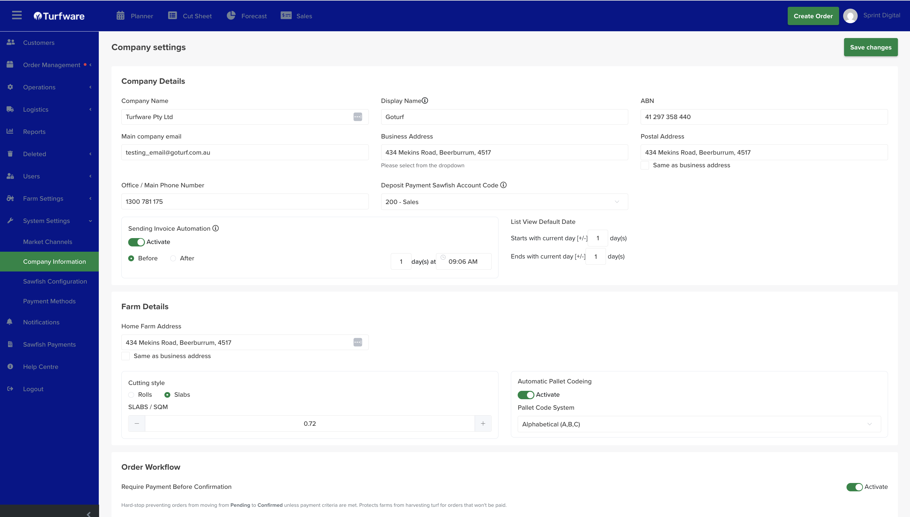
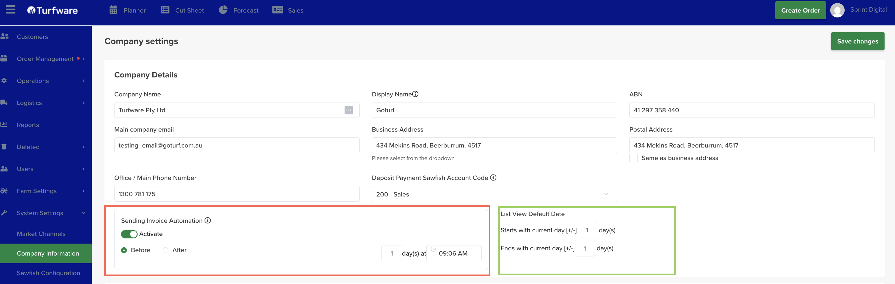
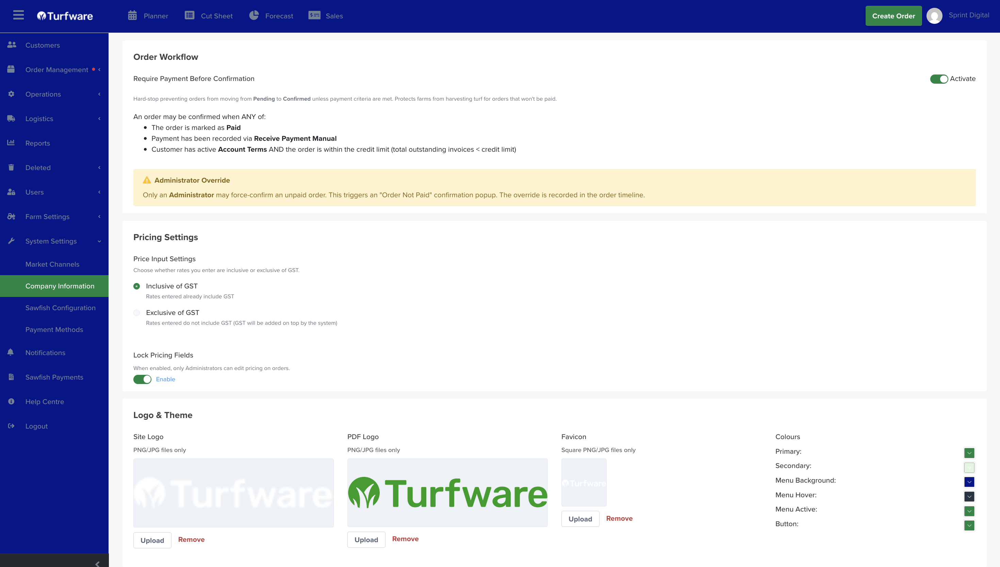
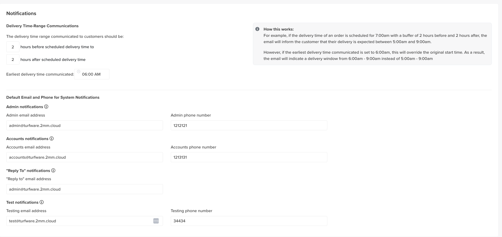
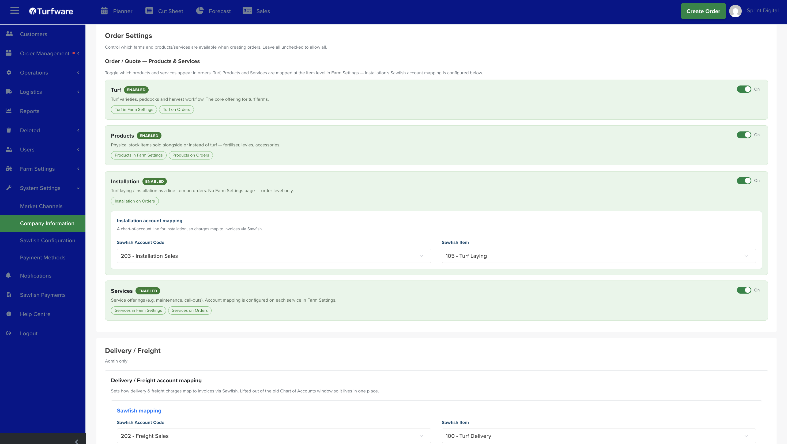

# Company Information

Company Information (headed Company settings in the app) is your central control panel — your business details plus the settings that govern the order workflow, pricing, invoicing, accounting mapping, notifications and branding. Each setting is a section below; change what you need and click Save changes (top right).

## Where to find it

Left-hand navigation → System Settings → Company Information.

## Company Details

- **Company Name and Display Name** — your legal name and the name shown to customers.
- ABN, Main company email, and Office / Main Phone Number.
- **Business Address and Postal Address** — select from the dropdown so they geocode; tick Same as business address to reuse the one address.
- **Deposit Payment Sawfish Account Code** — the account that deposits post to when you split an invoice into a deposit + final (see [Quotes](../../order-management/quotes.md)).

## Sending Invoice Automation

Turfware can automatically send invoices for confirmed orders around their delivery date, so you don't have to send each one by hand.

1. Toggle Sending Invoice Automation Activate ON.
2. Set the timing — whether the invoice sends Before or After the delivery date, the number of days, and the time of day the automation runs.
3. Click Save changes.

Invoices for confirmed orders with a matching delivery date are then sent automatically at the set time.

- **Send today's invoices** — set the number of days to 0 to send invoices for today's deliveries.
- **Pre-requisites** — make sure your Sawfish item and account codes are set on your turf, products and services first, so invoices can generate.
- **No duplicates** — invoices already sent won't be resent.

## List View Default Date

Sets the date range your list screens open on, relative to today:

- **Starts with current day [+/-]** — how many days before or after today the default range begins.
- **Ends with current day [+/-]** — how many days after or before today it ends.

For example, starts −1 and ends +1 opens your lists showing yesterday through tomorrow. Set it to match how far ahead or behind your team usually works.

## Farm Details

- Home Farm Address.
- **Cutting style** — Rolls or Slabs, plus the Slabs / SQM figure — the default cutting style applied to turf.
- **Automatic Pallet Coding** — Activate to auto-assign pallet codes, and choose the Pallet Code System (e.g. Alphabetical *A, B, C*).

## Order Workflow

Controls whether an order can be confirmed before it's paid — an important control for protecting the farm from harvesting turf for orders that won't be paid.

- **Require Payment Before Confirmation** — Activate to hard-stop an order moving Pending → Confirmed unless payment criteria are met. An order may be confirmed when *any* of these is true: it's marked Paid; a payment is recorded via Receive Payment (Manual); or the customer has active Account Terms *and* the order is within their credit limit (total outstanding invoices &lt; credit limit).
- **Administrator Override** — only an Administrator can force-confirm an unpaid order; this triggers an *"Order Not Paid"* popup and is recorded in the order [Timeline](../../order-management/creating-and-managing-an-order.md#the-timeline-tab).

## Pricing Settings

- **Price Input Settings** — whether the rates you enter are Inclusive of GST (rates already include GST) or Exclusive of GST (GST added on top by the system).
- **Lock Pricing Fields** — when enabled, only Administrators can edit pricing on orders.

## Logo & Theme

- Upload your Site Logo, PDF Logo (for invoices/documents) and Favicon (square).
- **Set your Colours** — Primary, Secondary, Menu Background, Menu Hover, Menu Active and Button.

## Notifications

- **Delivery Time-Range Communications** — the delivery window told to customers: N hours before to N hours after the scheduled delivery time. An Earliest delivery time communicated can override the start — e.g. a 7:00am delivery with a 2-hour buffer would read *5–9am*, but an earliest time of 6:00am makes it *6–9am*.
- Default Email and Phone for System Notifications — the Admin, Accounts, Reply-to and Test email addresses and phone numbers that system notifications use.

## Order Settings

Controls which products and services appear when creating orders, and how installation and freight charges map to your accounts. Leave everything unchecked to allow all.

### Order / Quote — Products & Services

Toggle which offerings appear on orders and quotes. Turf, Products and Services are set up at the item level in Farm Settings; Installation is order-level only.

- **Turf** — turf varieties, paddocks and the harvest workflow — the core offering for turf farms. (Set up in [Farm Settings → Turf](../farm-settings/turf-varieties.md).)
- **Products** — physical stock items sold alongside or instead of turf (fertiliser, levies, accessories). (Set up in [Products](../farm-settings/products.md).)
- **Installation** — turf laying / installation as a line item on orders. There's no Farm Settings page — it's order-level only, and its accounting is mapped below.
- **Services** — service offerings (e.g. maintenance, call-outs). Account mapping is configured on each service in [Farm Settings → Services](../farm-settings/services.md).

You can also restrict which farms are available when creating orders.

### Installation account mapping

A chart-of-account line for installation, so charges map to invoices via Sawfish. Set the Sawfish Account Code and Sawfish Item (e.g. *203 – Installation Sales* and *105 – Turf Laying*).

### Delivery / Freight account mapping

*(Admin only.)* Sets how delivery & freight charges map to invoices via Sawfish — lifted out of the old Chart of Accounts window so it lives in one place. Set the Sawfish Account Code and Sawfish Item (e.g. *202 – Freight Sales* and *100 – Turf Delivery*).

!!! note "Ties into the order page"
    What you enable here is exactly what shows in the Products & Services section when [creating an order](../../order-management/creating-and-managing-an-order.md).

## Miscellaneous

- **Google Review URL** — the link used to invite customers to leave a Google review.
