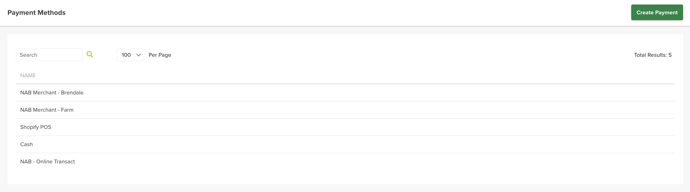

# Payment Methods

Payment Methods are the ways you accept payment — for example *Cash, Shopify POS*, or a bank *merchant account* (e.g. *NAB Merchant*). They appear when you record a payment against an order (Received Payment).

## Where to find it

Left-hand navigation → System Settings → Payment Methods. Click Create Payment to add one, or click a row to edit.

## Setting up a method

- **Name** — the payment method name.

The method is then selectable when [recording a payment on an order](../../order-management/creating-and-managing-an-order.md#moving-the-order-through-the-workflow).

