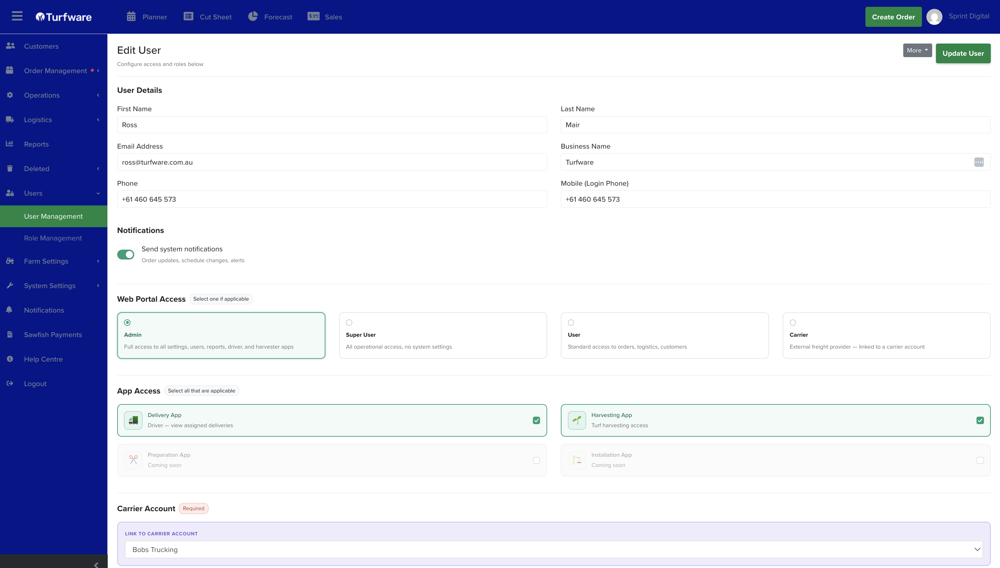

# Create a user

Users are your staff — the people who log in to Turfware and its apps. (Your customers are managed separately under [Customers](../customers/index.md), not here.)

## Where to find it

Left-hand navigation → Users → User Management. This lists your users; click Create User to add one, or open a user to edit them.

## User details

- First Name (required) and Last Name.
- Email Address (required) — this is their login.
- Business Name.
- Phone, and Mobile (Login Phone) — the mobile number used to sign in and receive login verification.

## Notifications

Turn on Send system notifications to have this user receive order updates, schedule changes and alerts.

## Set their access

Access is made up of three parts — see [User Roles](user-roles.md) for what each option means:

- **Web Portal Access** — choose one level of access to the web app: Admin, Super User, User or Carrier. Leave all four unselected if the person only needs a field app.
- **App Access** — tick any field apps they need (Delivery App, Harvesting App; Preparation and Installation apps are coming soon).
- **Carrier Account** — if you chose Carrier access, link the user to their carrier account here (required).
- **Tags** — apply a tag such as Sales Rep to mark the user's function.

Click Update User (or Create) to save. The user can now sign in with their email and password.

!!! note "Two-factor authentication"
    On first sign-in a user sets up two-factor authentication with an authenticator app (for example Google Authenticator). If someone gets locked out — a lost or changed phone, say — an administrator can reset their 2FA from the user's record so they can set it up again.
