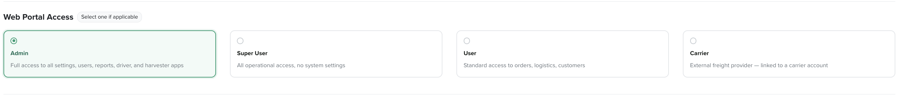
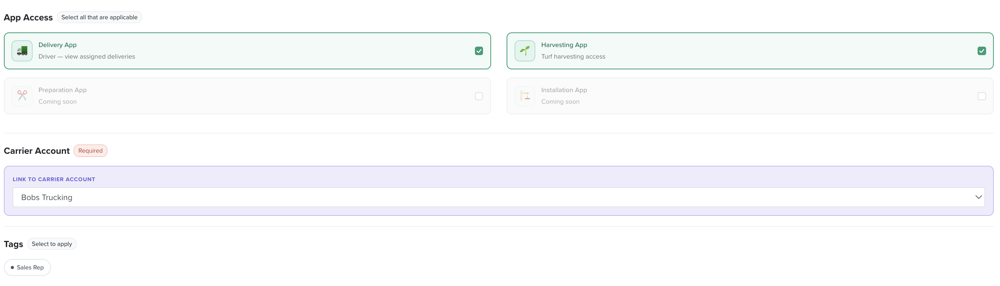

# User Roles

A user's access is built from three parts on their user record: **Web Portal Access** (their level in the web app), **App Access** (which field apps they can use), and **Tags** (their function). See [How access works](how-to-give-access-to-each-user-group.md) for the concept.

## Web Portal Access

Controls access to the web app (the admin portal). Choose **one** — or leave all unselected for someone who only needs a field app.

| Level | Access |
|---|---|
| **Admin** | Full access to all settings, users, reports, and the driver and harvester apps. |
| **Super User** | All operational access, no system settings. |
| **User** | Standard access to orders, logistics and customers. |
| **Carrier** | An external freight provider, linked to a carrier account (see below). |

## App Access

The field apps. Tick **any** that apply — a user can have more than one.

| App | Access |
|---|---|
| **Delivery App** | Drivers view their assigned deliveries. |
| **Harvesting App** | Turf harvesting access. |
| **Preparation App** | Coming soon. |
| **Installation App** | Coming soon. |

## Carrier Account

When a user is given **Carrier** web portal access, link them to their carrier account (this is required) — for example *Bobs Trucking*. That ties the external freight provider to their carrier's drivers, trucks and runs.

## Tags

Tags mark a user's function without changing their access level — for example **Sales Rep** flags a user as a rep. Apply tags in the Tags section of the user record.
